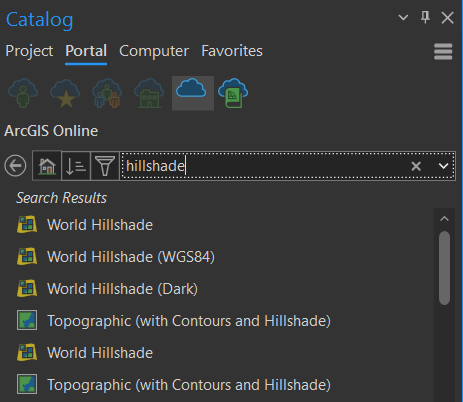

# Data sources
## Natural Earth Data
Natural Earth is a public domain map dataset available at 1:10m, 1:50m, and 1:110 million scales. Featuring tightly integrated vector and raster data, with Natural Earth you can make a variety of visually pleasing, well-crafted maps with cartography or GIS software.

Natural Earth was built through a collaboration of many volunteers and is supported by NACIS (North American Cartographic Information Society), and is free for use in any type of project (see our Terms of Use page for more information).

Data themes are available in three levels of detail. For each scale, themes are listed on Cultural, Physical, and Raster category pages.

[naturalearthdata.com Natural Earth Data](https://www.naturalearthdata.com/downloads/){ .md-button .md-button--primary .server_name .external_link_icon_small target="_blank"}
{: .button_array}

## Open Street Map
OpenStreetMap (OSM) is a free, open geographic database updated and maintained by a community of volunteers via open collaboration. Contributors collect data from surveys, trace from aerial imagery and also import from other freely licensed geodata sources. OpenStreetMap is freely licensed under the Open Database License and as a result commonly used to make electronic maps, inform turn-by-turn navigation, assist in humanitarian aid and data visualisation. OpenStreetMap uses its own topology to store geographical features which can then be exported into other GIS file formats. The OpenStreetMap website itself is an online map, geodata search engine and editor.

!!! note "How to download OSM data"

    **1. Directly from OSM**
    
    The first method is to download directly from the OpenStreetMap website using their exporter. Simply go to [OSM](www.openstreetmap.org) and find the area you would like to download data for. Hit the *Export* button and you can manually select a desired area by bounding box. Then you can download the file as a .osm file. When working in ArcGIS Pro, you will need to download and install a special *Data Interoperability* extension, which is not a part of the standard package and requires a special license from your site license coordinator.

    [openstreetmap.org OSM](https://www.openstreetmap.org){ .md-button .md-button--primary .server_name .external_link_icon_small target="_blank"}
    {: .button_array}
     
    **2. Geofabrik**
    
    This server has data extracts from the OpenStreetMap project which are normally updated every day. Select your continent and then your country of interest from the menu. This open data download service is offered free of charge by Geofabrik GmbH.

    [http://download.geofabrik.de/ Geofabrik](http://download.geofabrik.de/){ .md-button .md-button--primary .server_name .external_link_icon_small target="_blank"}
    {: .button_array}

    **3. Overpass Turbo**

    This is a web-based data filtering tool for OpenStreetMap. With **overpass turbo** you can run *Overpass API* queries and analyse the resulting OSM data interactively on a map. There is an integrated *Wizard* which makes creating queries super easy.

    [https://overpass-turbo.eu/ OverpassTurbo](https://overpass-turbo.eu/){ .md-button .md-button--primary .server_name .external_link_icon_small target="_blank"}
    {: .button_array}

    ???+ example "Query examples"
        *get all peaks in the bounding box*

            [out:json];
            node[natural=peak]({{bbox}});
            out body;

        *get all railway stations in Prague*

            area[name="Praha"];
            nwr(area)[railway=station];
            out;

    **4. BBBike**

    BBBike extracts allows you to extracts areas from Planet.osm in OSM, PBF, o5m, Garmin, Organic Maps, mbtiles, OsmAnd, Esri shapefile, mapsforge, OPL, GeoJSON, SQLite, text or CSV format. The maximum area size is 24,000,000 square km, or 1500 MB file size. It takes between 2-7 minutes to extract an area. The email field is required, you will be notified by email if your extract is ready for download. Please use a meaningfull name for the extract.

    [https://extract.bbbike.org// BBBike](https://extract.bbbike.org/){ .md-button .md-button--primary .server_name .external_link_icon_small target="_blank"}
    {: .button_array}

    ???+ example "How to use the BBBike extract service"
        – move the map to your desired location

        – click to create the bounding box

        – move or resize the bounding box, or add new points to the polygon

        – select a Format, enter Your email address and Name of area to extract

        – click the extract button. Wait for email notification and download the map. Done!

## ArcGIS Online

There is a simple solution how to add various data when using ArcGIS Pro. If you browse your *Catalog Pane* to the *Portal* tab and then choose *ArcGIS Online* icon, you can look up for data shared through ArcGIS Online by many institutions or authors and easily add them to your map.

<figure markdown>
  { width=600px }
  <figcaption>Add data from ArcGIS Online</figcaption>
</figure>

## WMS, WFS

A **web map service** (WMS) is a standard protocol for serving geospatial data as images (e.g., PNG, JPEG) over the web. It allows clients to request maps and map layers from a server and display them on a map viewer or client application.

A **web feature service** (WFS) refers to a standard protocol for serving geospatial data as vector features (e.g., points, lines, polygons) over the web. It allows clients to request specific feature data from a server and perform operations on the data, such as querying, inserting, updating, and deleting features.