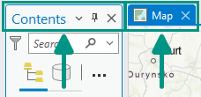
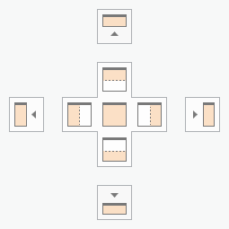
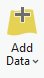
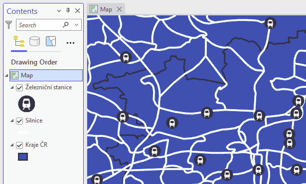
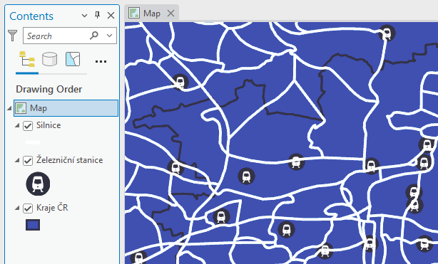
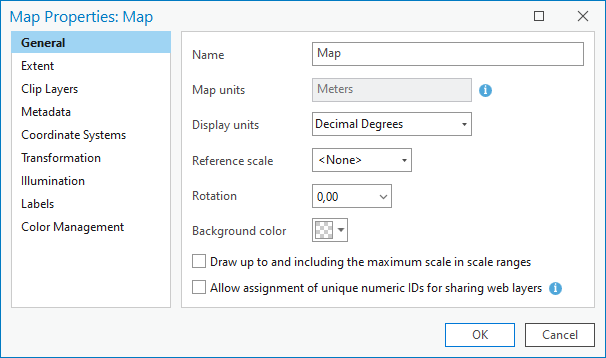
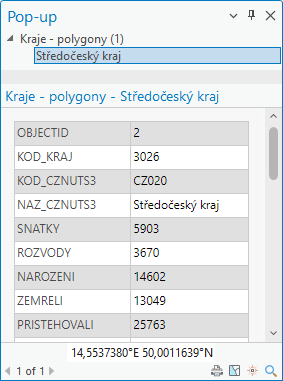
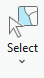
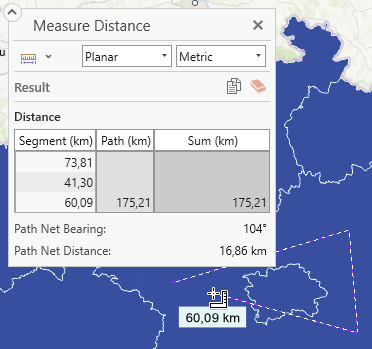

<!-- Definice sipky do FlexBoxu (pro referenci) – UZ NENI TREBA
<svg style="display: none" version="2.0">
  <defs>
    <symbol id="rect-arrow-right" viewBox="0 0 24 24">
      <path d="M5,21A2,2 0 0,1 3,19V5A2,2 0 0,1 5,3H19A2,2 0 0,1 21,5V19C21,20.11 20.1,21 19,21H5M6,13H14.5L11,16.5L12.42,17.92L18.34,12L12.42,6.08L11,7.5L14.5,11H6V13Z"
        style="fill:var(--md-primary-fg-color)" />
    </symbol>
    <symbol id="caret-right" height="1em" viewBox="0 0 256 512">
      <path d="M246.6 278.6c12.5-12.5 12.5-32.8 0-45.3l-128-128c-9.2-9.2-22.9-11.9-34.9-6.9s-19.8 16.6-19.8 29.6l0 256c0 12.9 7.8 24.6 19.8 29.6s25.7 2.2 34.9-6.9l128-128z" style="fill:var(--md-primary-fg-color)" />
    </symbol>
  <defs>
</svg> -->

# Úvod do práce v prostředí ArcGIS, prostorová data, datové zdroje

## Cíl cvičení

Seznámení s programem ArcGIS Pro, základní orientace v prostředí programu, přidávání dat do mapy a ovládání mapy

## Základní pojmy

### Software pro výuku
Během většiny výuky bude používán program **ArcGIS Pro** – pokročilý desktopový geografický informační systém (GIS) vyvinutý společností **Esri**. Umožňuje uživatelům **vytvářet**, **editovat**, **analyzovat** a **vizualizovat** prostorová data v různých vrstvách, včetně **rastrových** a **vektorových** map, **ortofotomap**, **digitálního výškového modelu** a dalších datasetů.  
Uživatelé mohou vytvářet a upravovat **atributy** a **geometrii** prvků, provádět pokročilé **analýzy**, vytvářet a **publikovat mapové vrstvy** a vytvářet **interaktivní mapové aplikace**. Program obsahuje také nástroje pro **vizualizaci** dat, tvorbu mapových prezentací a **sdílení výsledků** s ostatními uživateli.  

{ .off-glb width=200px style="filter:none !important;"}
{ .off-glb width=200px style="filter:none !important;"}
{: align=center}

???+ note "&nbsp;Pozn."
      Vzhledem k vysokým pořizovacím nákladům se systém ArcGIS využívá především ve velkých firmách a orgánech státní správy. V menších podnicích je rozšířenější jeho open source alternativa QGIS (tomu bude věnována pozornost v závěru kurzu).

### Prostorová (GIS) data (vektorová)
Geografický informační systém (GIS) využívá obecně jakákoliv data obsahující __prostorovou (polohovou) informaci__. Poloha může být reprezentována nejen kombinací souřadnic (_X + Y_, _šířka + délka_ aj.), ale také např. adresou (o libovolné podrobnosti). Doplňkem k polohové informaci obvykle bývá připojena jakákoliv další informace formou atributů v __atributové tabulce__.

{ style="width:80%;"}
{: style="margin-bottom:0px;" align=center }
<figcaption>Schematická ukázka prostorových dat a k nim přiřazených atributových tabulek</figcaption>

__Ukládání prostorových dat__: Data lze ukládat mnoha různými způsoby. Datových formátů existuje mnoho, pro začátek uvedeme některé základní.

- __Shapefile__: formát od spol. _Esri_ s převážně otevřenou specifikací, obsahuje geometrii a vlastnosti (atributy) prostorových prvků, v současnosti asi nejpoužívanější, přestože má mnoho nevýhod a z dnešního pohledu je poněkud zastaralý, jedna z charakteristik formátu je povinné rozdělení do více souborů (`.shp`, `.shx` a `.dbf`, příp. další nepovinné), což přináší obtíže při přesouvání, kopírování apod.
- __Geodatabáze (GDB)__: nativní datová struktura systému _ArcGIS_ – primární datový formát pro správu a editaci dat, obsahuje kolekci datasetů různých typů (vektor, rastr i jiné), zároveň dokáže uchovávat údaje o datové integritě (domény, subtypy apod.) nebo topologii
- __GeoJSON__: otevřený standard reprezentující vektorová data a přiřazené atributy, založen na formátu `JSON` a je tedy uživatelsky čitelný a velmi rozšířený
- __GML / KML__: podobně jako GeoJSON – otevřený standard reprezentující vektorová data a přiřazené atributy, založen na formátu `XML`, tedy opět uživatelsky čitelný
- __GeoPackage (GPKG)__: relativně nový formát _standardu OGC_, podporuje vektorová i rastrová data, překonává mnoho limitů formátu `Shapefile` (např. se jedná o pouze 1 soubor), výchozí formát systému _QGIS_
- __CSV__: sice není formátem přímo určeným pro prostorová data, nicméně často se jako výměnný formát používá, soubor obsahuje pouze atributy, z nichž některé mohou reprezentovat prostorovou složku (souřadnice či adresu) – tu pak GIS software rozpozná a polohově vizualizuje

<!-- Ve výčtu chybí některé __rastrové formáty__, těm se bude výuka věnovat v průběhu pozdějších cvičení. -->

## Náplň cvičení

### Spuštění a základní orientace v programu

Při spuštění probíhá ověření licence přes příslušnost k organizaci (ČVUT v Praze) – pomocí přihlášení k univerzitnímu účtu. Adresa (URL) pro ČVUT je *ctuprague.maps.arcgis.com* – poté proběhne automatické přesměrování na stránku s univerzitním přihlášením (ve formátu *username@cvut.cz* a heslo to KOSu).

  
<iframe src="https://www.youtube.com/embed/8nDVpVmxM-0" title="YouTube video player" frameborder="0" allow="accelerometer; autoplay; clipboard-write; encrypted-media; gyroscope; picture-in-picture; web-share" allowfullscreen></iframe>

  

<table>
  <tbody>
    <tr>
      <td><strong>RIBBON</strong></td>
      <td>nabídka funkcí programu (prvek shodný s jinými programy, např. Microsoft Word), nabídka se kontextově mění podle akcí uživatele</td>
    </tr>
    <tr>
      <td><strong>PANE</strong></td>
      <td>panely a vlastnosti funkcí, mnoho funkcí spouští svůj Pane, přes který se daná funkce ovládá, např. Obsah mapy (Contents), Symbologie</td>
    </tr>
    <tr>
      <td><strong>VIEW</strong></td>
      <td>okno s mapou (2D) nebo scénou (3D)</td>
    </tr>
  </tbody>
</table>

{: .process_container}

<figcaption>Všechny VIEWs a PANEs jsou dokovatelné – je možné je libovolně přemisťovat po obrazovce a přichytávat k ostatním prvkům</figcaption>

<!-- :fontawesome-brands-youtube:{: style="color: #EE0F0F" } [__Working with Panes in ArcGIS Pro__](https://www.youtube.com/watch?v=qNDwVJV_kFk).
{: align=center } -->

[:material-open-in-new: Working with Panes in ArcGIS Pro](https://www.youtube.com/watch?v=qNDwVJV_kFk){ .md-button .md-button--primary .button_smaller target="_blank"}
{: align=center style="display:flex; justify-content:center; align-items:center; column-gap:20px; row-gap:10px; flex-wrap:wrap;"}

---

 

Další zdroje:

[:material-open-in-new: pro.arcgis.com Introduction to ArcGIS Pro](https://pro.arcgis.com/en/pro-app/latest/get-started/get-started.htm){ .md-button .md-button--primary .url-name target="_blank"}
[:material-open-in-new: pro.arcgis.com Introducing ArcGIS Pro](https://pro.arcgis.com/en/pro-app/latest/get-started/introducing-arcgis-pro.htm){ .md-button .md-button--primary .url-name target="_blank"}
{: align=center style="display:flex; justify-content:center; align-items:center; column-gap:20px; row-gap:10px; flex-wrap:wrap;"}

### Přidání dat do mapy

__Vytvoření mapy__:&nbsp;<code class="AGPF">:material-tab: Insert</code>&nbsp;→&nbsp;<code class="AGPF">:material-button-cursor: New Map</code>
{: style="margin-left:calc((100vw * 0.03) - 6px)"}
{: style="display:flex !important; justify-content:flex-start; align-items:center;"}

[:material-open-in-new: Create a map or scene](https://pro.arcgis.com/en/pro-app/latest/help/projects/add-maps-to-a-project.htm#GUID-660CA711-919A-44B0-952A-F2054937077B){ .md-button .md-button--primary .button_smaller target="_blank"}
{: align=center style="display:flex; justify-content:center; align-items:center; column-gap:20px; row-gap:10px; flex-wrap:wrap;"}

---

__Přidání dat do mapy__ (lokálně uložených): <code class="AGPF">:material-tab: Map</code> → <code class="AGPF">:material-button-cursor: Add Data</code> → <code class="AGPF">:material-button-cursor: Data</code> → vybrat soubor...

{: .off-glb .process_icon}

{: .off-glb .process_icon}

{: .process_container}

<figcaption>Pokud se soubor ve struktuře neobjevuje, lze dialog obnovit klávesou F5</figcaption>

[:material-open-in-new: Add data from the Add Data dialog box](https://pro.arcgis.com/en/pro-app/latest/help/mapping/layer-properties/add-layers-to-a-map.htm#ESRI_SECTION2_1C48753A1FD546F385580EF9197DBB8C){ .md-button .md-button--primary .button_smaller target="_blank"}
{: align=center style="display:flex; justify-content:center; align-items:center; column-gap:20px; row-gap:10px; flex-wrap:wrap;"}

---

Aby pro procházení dat nebylo nutné pokaždé procházet adresářovou strukturu, hodí se si adresáře s daty _připojit do projektu_.

__Připojení adresáře do projektu__: V _Catalog Pane_ ( <code class="AGPF">:material-tab: View</code> → <code class="AGPF">:material-button-cursor: Catalog Pane</code> ) přes pravé tl. myši na "_Folders_" vybrat <code class="AGPF">:material-form-dropdown: Add Folder Connection</code> → vložit nebo zvolit cestu... → data ve složce přetáhnout (Drag&Drop) do prostoru mapy

{: .off-glb .process_icon}

{: .off-glb .process_icon}

{: .off-glb .process_icon}

{: .process_container}

<figcaption>Cesta ke zvolenému adresáři zůstane v nabídce mezi položkami "Folders". Adresář nemusí být lokální, lze takto připojit i např. fakultní disk H:\.</figcaption>

[:material-open-in-new: Connect to a folder](https://pro.arcgis.com/en/pro-app/latest/help/projects/connect-to-a-folder.htm){ .md-button .md-button--primary .button_smaller target="_blank"}
[:material-open-in-new: The Project Pane](https://pro.arcgis.com/en/pro-app/latest/help/projects/the-project-pane.htm){ .md-button .md-button--primary .button_smaller target="_blank"}
{: align=center style="display:flex; justify-content:center; align-items:center; column-gap:20px; row-gap:10px; flex-wrap:wrap;"}

---

...totéž lze udělat s geodatabází. V geodatabázi jsou data uložena efektivněji, nelze do ní však vložit cokoli.

__Připojení geodatabáze do projektu__: V _Catalog Pane_ ( <code class="AGPF">:material-tab: View</code> → <code class="AGPF">:material-button-cursor: Catalog Pane</code> ) přes pravé tl. myši na "_Databases_" vybrat <code class="AGPF">:material-form-dropdown: Add Database</code> → vložit nebo zvolit cestu ke geodatabázi... → data ve složce přetáhnout (Drag&Drop) do prostoru mapy

{: .off-glb .process_icon}

{: .off-glb .process_icon}

{: .off-glb .process_icon}

{: .process_container}

<figcaption>Cesta ke zvolené geodatabázi zůstane v nabídce mezi položkami "Databases". Cesta opět nemusí být pouze lokální.</figcaption>

[:material-open-in-new: Connect to a database](https://pro.arcgis.com/en/pro-app/latest/help/projects/connect-to-a-database.htm){ .md-button .md-button--primary .button_smaller target="_blank"}
{: align=center style="display:flex; justify-content:center; align-items:center; column-gap:20px; row-gap:10px; flex-wrap:wrap;"}

---

__Pořadí vrstev__: V obsahu mapy (_Contents Pane_) se zobrazují všechny vrstvy obsažené v mapě. Zaškrtávacím políčkem vlevo lze jednotlivým vrstvám přepínat viditelnost. Výměnou pořadí vrstev v obsahu se změní jejich pořadí vykreslování v mapě.

{: .off-glb .process_icon}

{: .off-glb .process_icon}

{: .process_container}

<figcaption>Contents Pane a změna pořadí a přepínání viditelnosti vrstev</figcaption>

---

__Nastavení (vlastnosti) mapy__: V _Contents Pane_ (Obsah) přes pravé tl. myši na název mapy vybrat <code class="AGPF">:material-form-dropdown: Properties</code>

{: .off-glb .process_icon}

{: .off-glb .process_icon}

{: .process_container}

Pro začátek jsou zajímavé tyto položky:

- __Záložka "_General_"__:

    - __Name__ (Název mapy)
    - __Reference scale__ (Referenční měřítko): Zafixuje velikost mapové symbologie pro zadané měřítko. 
    [:material-open-in-new: Map reference scales](https://pro.arcgis.com/en/pro-app/latest/help/mapping/properties/map-reference-scales.htm){ .md-button .md-button--primary .button_smaller target="_blank" align=right}
    - __Rotation__: Úhel natočení mapy

- __Záložka "_Coordinate systems_"__: Informace o souřadnicovém systému zobrazení mapy (zvlášť pro polohu a pro výšku).

    - __POZOR__, pokud se souř. systém __vložených dat__ liší od systému __mapy__, jsou data __dočasně__ převedena do souř. systému __mapy__. Jedná se však o tzv. __On-the-fly__ transformaci, která je pro kombinaci některých souř. systémů __zjednodušená__ a data na sebe nemusí správně navazovat. Tato situace se __nedoporučuje__, neboť může přinést __nepřesné výsledky__ mapové vizualizace i datových analýz. <a href="https://www.esri.com/arcgis-blog/products/arcgis-pro/mapping/projection-on-the-fly-and-geographic-transformations">__Podrobnější informace__</a>
    {: style="color:#888;font-size:smaller; line-height:1.1;"}

 

### Kde získat data

__Lokálně uložené soubory__:  přístup přes systémovou cestu, např.:

_C:\Users\Student1\Documents\Geodatabase.gdb\Layer1_
{: align="center" style="font-size:smaller;line-height:1.1;"}

_\\\\data.fsv.cvut.cz\Shares\K155\Public\data\PragueRoads.gdb_
{: align="center" style="font-size:smaller;line-height:1.1;"}

__Data online ke stažení__: stažení z libovolného zdroje na lokální disk ve formě souborů, dále shodný přístup jako s lokálně uloženými soubory (viz výše)

[:material-open-in-new: ArcČR](https://www.arcgis.com/home/item.html?id=16fd9804dac04020938452a77c1ed350){ .md-button .md-button--primary .button_smaller target="_blank"}
[:material-open-in-new: Geoportal Praha](https://www.geoportalpraha.cz/cs/data/otevrena-data/seznam){ .md-button .md-button--primary .button_smaller target="_blank"}
[:material-open-in-new: Geoportal data.Brno](https://data.brno.cz/explore){ .md-button .md-button--primary .button_smaller target="_blank"}
[:material-open-in-new: otevřená data AOPK](https://gis-aopkcr.opendata.arcgis.com/){ .md-button .md-button--primary .button_smaller target="_blank"}
{: align=center style="display:flex; justify-content:center; align-items:center; column-gap:20px; row-gap:10px; flex-wrap:wrap;"}

__Připojení streamovaných dat__: _bude součástí budoucích cvičení_
{: style="color:#888"}

- připojení datových služeb přes URL adresu, nevyžaduje ruční lokální ukládání, existuje více standardů pro poskytování těchto služeb
{: style="color:#888;font-size:smaller; line-height:1.1;"}

 

### Ovládání mapy

__Explore Tool__: Pohyb v mapě a vyvolávání pop-upů (vyskakovacích oken), funkce tlačítek myši viz obr.

- __Pop-up__ (Vyskakovací okno): Je jedním ze základních prvků grafického prostředí GIS aplikací. Jeho (nejčastějším) účelem je poskytnout rychlý náhled informací o daném prvku po kliknutí na jeho geometrii. Podoba okna je ale konfigurovatelná a nástroje pro úpravu velice variabilní. Ve výchozím stavu pop-up zobrazuje výpis atributů ve formě tabulky (obr.).
[:material-open-in-new: Pop-ups](https://pro.arcgis.com/en/pro-app/latest/help/mapping/navigation/pop-ups.htm){ .md-button .md-button--primary .button_smaller target="_blank"}
- __Měřítko mapy__: Udává poměr zmenšení mapy vzhledem ke skutečnosti. V rohu mapového okna (obr.) lze vybrat z nabízených měřítek nebo i nastavit libovolnou vlastní hodnotu.
[:material-open-in-new: Map scales and scale properties](https://pro.arcgis.com/en/pro-app/latest/help/mapping/navigation/map-scales-and-scale-properties.htm){ .md-button .md-button--primary .button_smaller target="_blank"}

{: .off-glb .process_icon}

{: .off-glb .process_icon}

{: .off-glb .process_icon}

{: .process_container}

[:material-open-in-new: Navigation](https://pro.arcgis.com/en/pro-app/latest/help/mapping/navigation/navigation-in-arcgis-pro.htm){ .md-button .md-button--primary .button_smaller target="_blank"}
[:material-open-in-new: Navigate maps and scenes](https://pro.arcgis.com/en/pro-app/latest/get-started/navigate-your-data.htm){ .md-button .md-button--primary .button_smaller target="_blank"}
{: align=center style="display:flex; justify-content:center; align-items:center; column-gap:20px; row-gap:10px; flex-wrap:wrap;"}

---

__Select Tool__: Pohyb v mapě a interaktivní vybírání prvků kurzorem. Zrušení výběru viz obr.
{: #select-tool}

{: .off-glb .process_icon}

{: .off-glb .process_icon}

{: .off-glb .process_icon}

{: .process_container}

[:material-open-in-new: Select features interactively](https://pro.arcgis.com/en/pro-app/latest/help/mapping/navigation/select-features-interactively.htm){ .md-button .md-button--primary .button_smaller target="_blank"}
[:material-open-in-new: Select features for editing](https://pro.arcgis.com/en/pro-app/latest/help/editing/select-features-for-editing.htm){ .md-button .md-button--primary .button_smaller target="_blank"}
{: align=center style="display:flex; justify-content:center; align-items:center; column-gap:20px; row-gap:10px; flex-wrap:wrap;"}

---

__Measure Tool__: Interaktivní měření vzdáleností, úhlů apod.

{: .off-glb .process_icon}

{: .off-glb .process_icon}

{: .process_container}

[:material-open-in-new: Measure](https://pro.arcgis.com/en/pro-app/latest/help/mapping/navigation/measure.htm){ .md-button .md-button--primary .button_smaller target="_blank"}
{: align=center style="display:flex; justify-content:center; align-items:center; column-gap:20px; row-gap:10px; flex-wrap:wrap;"}

 

 

Doplňkové zdroje:

[:material-open-in-new: pro.arcgis.com ArcGIS Pro keyboard shortcuts](https://pro.arcgis.com/en/pro-app/latest/get-started/arcgis-pro-keyboard-shortcuts.htm){ .md-button .md-button--primary .url-name target="_blank"}
[:material-open-in-new: PDF ArcGIS Pro shortcuts](https://www.esri.com/content/dam/esrisites/en-us/media/pdf/g526942-arcgis-pro-kybrd-shrtct-FINAL.pdf){ .md-button .md-button--primary .url-name target="_blank"}
{: align=center style="display:flex; justify-content:center; align-items:center; column-gap:20px; row-gap:10px; flex-wrap:wrap;"}

 

## Úloha (DODĚLAT!!)

- Najít a stáhnout data z konkrétního geoportálu (nebo něco připojit nebo obojí) v .shp
- Nastavit mapě ref. měřítko a rotaci
- Nastavit pořadí vrstev
- Nastavit přesné měřítko
- Vybrat některé konkrétní prvky (pár konkrétně zadaných)
- Screenshot mapy splňující všechny výše popsané vlastnosti
- Screenshot pop-upu nad zadaným prvkem
- Napsat vzdálenost mezi konkrétními dvěma prvky

           

<!-- 
                  

Test nadpisů:

# Nadpis 1

## Nadpis 2

### Nadpis 3

#### Nadpis 4

##### Nadpis 5

###### Nadpis 6

...další text...

 -->
