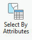
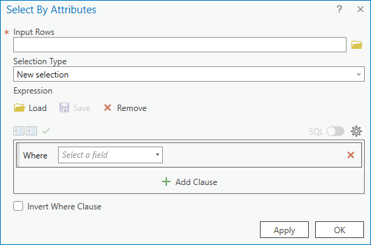
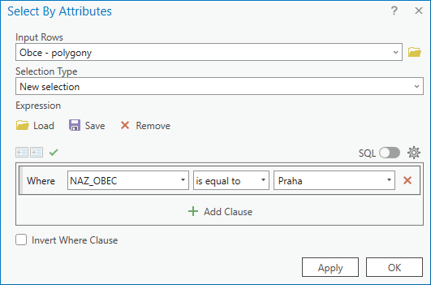
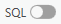

# Vektorová data, atributové dotazy, prostorové dotazy

<!-- ## Cíl cvičení -->

## Základní pojmy

### Vektorová a rastrová prostorová data

  

    <svg xmlns="http://www.w3.org/2000/svg" viewBox="0 0 24 24"><path d="M2 3v6h2.95l2 6H6v6h6v-4.59L17.41 11H22V5h-6v4.57L10.59 15H9.06l-2-6H8V3M4 5h2v2H4m14 0h2v2h-2M8 17h2v2H8Z"></path></svg>&nbsp;
    <strong>Vektorová data</strong>
    

    
Tvořena <strong>vrcholy</strong> (Vertices) a <strong>cestami</strong> (Paths) – ty jsou určeny skutečnými souřadnicemi

    
Podrobnost je určena <strong>podrobností souřadnic vrcholů</strong>

    
Vhodné pro <strong>diskrétně rozložená data</strong> (např. poloha bodů, kategorie pokrytí půdy)

    
Možné problémy s <strong>topologií</strong> (mezery a překryvy)

  

  

    <svg xmlns="http://www.w3.org/2000/svg" viewBox="0 0 24 24"><path d="M10 4v4h4V4h-4m6 0v4h4V4h-4m0 6v4h4v-4h-4m0 6v4h4v-4h-4m-2 4v-4h-4v4h4m-6 0v-4H4v4h4m0-6v-4H4v4h4m0-6V4H4v4h4m2 6h4v-4h-4v4M4 2h16a2 2 0 0 1 2 2v16a2 2 0 0 1-2 2H4c-1.08 0-2-.9-2-2V4a2 2 0 0 1 2-2Z"></path></svg>&nbsp;
    <strong>Rastrová data</strong>
    součástí budoucích cvičení
    

    
Tvořena pravidelnou mřížkou <strong>pixelů</strong> – ty jsou určeny pixelovými souřadnicemi (pořadí řádku/sloupce)

    
Podrobnost je určena <strong>velikostí pixelu</strong> (v metrech)

    
Vhodné pro jevy měnící se <strong>spojitě</strong> (např. model terénu, znečištění ovzduší) i <strong>diskrétně</strong>, dále pak <strong>obrazová data</strong> (např. satelitní)

  

<!-- ## Použité datové podklady -->

## Náplň cvičení

### Atributové dotazy

Atributový dotaz (Attribute Query) je metoda výběru/filtrace prvků na základě **hodnot jejich atributů**. Doplňuje tak metodu [interaktivního výběru prvků](/cviceni/cviceni1/#select-tool) z 1. cvičení. Základem je pravidlo pro výběr – tzv. **výraz** (Expression). ArcGIS Pro umožňuje sestavovat výrazy interaktivně pomocí dialogu, nicméně pro využití plného potenciálu výrazů je vhodné využít kód v jazyce _SQL_.
  

**Atributový dotaz** (nad daty v mapě): <code class="AGPF">:material-tab: Map</code> → <code class="AGPF">:material-button-cursor: Select By Attributes</code> → vyplnit údaje do dialogu nástroje...
[:material-open-in-new: Select features using attributes](https://pro.arcgis.com/en/pro-app/latest/help/mapping/navigation/select-features-using-attributes.htm){ .md-button .md-button--primary .button_smaller target="\_blank"}

{: .off-glb .process_icon}

{: .off-glb .process_icon}

{: .process_container}

<figcaption>Do pole <code>Input Rows</code> je automaticky předvyplněna vrstva vybraná v obsahu mapy </figcaption>

Pomocí přepínátka {: .off-glb style="vertical-align: -20%;margin:0px 5px;"} lze měnit zápis mezi interaktivním dialogovým zadáním a výrazem v jazyce SQL.

[:material-open-in-new: Introduction to query expressions](https://pro.arcgis.com/en/pro-app/latest/help/mapping/navigation/write-a-query-in-the-query-builder.htm){ .md-button .md-button--primary .button_smaller target="\_blank"}
[:material-open-in-new: Construct and modify queries](https://pro.arcgis.com/en/pro-app/latest/help/mapping/navigation/construct-and-modify-queries.htm){ .md-button .md-button--primary .button_smaller target="\_blank"}
{: align=center style="display:flex; justify-content:center; align-items:center; column-gap:20px; row-gap:10px; flex-wrap:wrap;"}

  
Příklad k vyzkoušení

testování atributových dotazů na skutečných datech

  <iframe style="filter:none !important;margin-top:.6rem;" width="100%" height="500" frameborder="0" allowfullscreen src="https://experience.arcgis.com/experience/cbee738914f543748264319797ea0711/?draft=true&org=CTUPrague"></iframe>
  

  
Schéma atributů vrstvy:

  
  
  <table id="small_table_padding">
    <tr>
      <th>atribut</th>
      <th>datový typ</th>
      <th>popis</th>
    </tr>
    <tr>
      <td>stop_name</td>
      <td><code>string</code></td>
      <td>Název zastávky</td>
    </tr>
    <tr>
      <td>routes_nam</td>
      <td><code>string</code></td>
      <td>Označení linek, které obsluhují zastávku, ve formátu <code>-cislolinky-,-cislolinky-</code> řazeno vzestupně</td>
    </tr>
    <tr>
      <td>route_type</td>
      <td><code>integer</code></td>
      <td>ID druhu dopravy, které obsluhují zastávku,  <code>0=tramvaj</code>, <code>1=metro</code>, <code>2=vlak</code>, <code>3=autobus</code>, <code>4=přívoz</code>, <code>7=lanovka</code>, <code>8=tramvaj i autobus</code></td>
    </tr>
    <tr>
      <td>on_request</td>
      <td><code>integer</code></td>
      <td>Zastávka na znamení <code>0=není na znamení</code>, <code>1=je na znamení</code></td>
    </tr>
    <tr>
      <td>platf_len</td>
      <td><code>float</code></td>
      <td>Délka nástupiště (metry)</td>
    </tr>
  </table>

### Prostorové dotazy

Prostorový dotaz (Spatial Query) je metoda výběru/filtrace prvků jedné vrstvy na základě vzájemné polohy s prvky druhé vrstvy.

[:material-open-in-new: Select features by location](https://pro.arcgis.com/en/pro-app/latest/help/mapping/navigation/select-features-by-location.htm){ .md-button .md-button--primary .button_smaller target="\_blank"}
[:material-open-in-new: Select Layer By Location (Data Management)](https://pro.arcgis.com/en/pro-app/latest/tool-reference/data-management/select-layer-by-location.htm){ .md-button .md-button--primary .button_smaller target="\_blank"}
[:material-open-in-new: Select By Location graphic examples](https://pro.arcgis.com/en/pro-app/latest/tool-reference/data-management/select-by-location-graphical-examples.htm){ .md-button .md-button--primary .button_smaller target="\_blank"}
{: align=center style="display:flex; justify-content:center; align-items:center; column-gap:20px; row-gap:10px; flex-wrap:wrap;"}

              

<!-- ## Zadání domácího úkolu k semestrální práci -->
