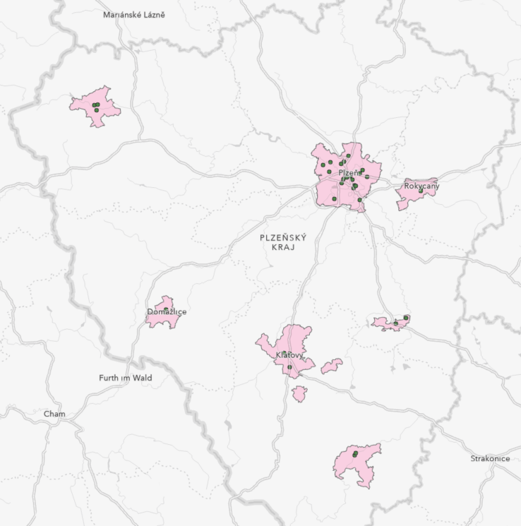

# Prostorové funkce (geoprocessing), spatial join

## Cíl cvičení

Seznámení se se základními geoprocessingovými nástroji v GIS v rámci řešení komplexní úlohy.

## Základní pojmy

- [**buffer**](https://pro.arcgis.com/en/pro-app/latest/tool-reference/analysis/buffer.htm)
- [**clip**](https://pro.arcgis.com/en/pro-app/latest/tool-reference/analysis/clip.htm)
- [**select**](https://pro.arcgis.com/en/pro-app/latest/tool-reference/analysis/select.htm)
- [**intersect**](https://pro.arcgis.com/en/pro-app/latest/tool-reference/analysis/intersect.htm)
- [**spatial join**](https://pro.arcgis.com/en/pro-app/latest/tool-reference/analysis/spatial-join.htm)
- [**erase**](https://pro.arcgis.com/en/pro-app/latest/tool-reference/analysis/erase.htm)
- [**union**](https://pro.arcgis.com/en/pro-app/latest/tool-reference/analysis/union.htm)
- [**remove overlap**](https://pro.arcgis.com/en/pro-app/latest/tool-reference/analysis/remove-overlap-multiple.htm)
- [**symmetrical difference**](https://pro.arcgis.com/en/pro-app/latest/tool-reference/analysis/symmetrical-difference.htm)
- [**count overlapping features**](https://pro.arcgis.com/en/pro-app/latest/tool-reference/analysis/count-overlapping-features.htm)

## Použité datové podklady

- [Pobočky](../assets/cviceni3/PobockyCP_PlzenskyKraj.zip) České pošty v Plzeňském kraji (bodová vrstva)
- Obce ČR ([ArcČR 500](../../data/#arccr-500), polygonová vrstva)

## Náplň cvičení

Představte si, že pracujete jako GIS analytik pro Českou poštu a vaším úkolem je z důvodu úspor navrhnout řešení snížení počtu poboček. Snahou tohoto kroku je však i minimalizace negativních dopadů na obyvatele, proto bylo rozhodnuto o následujících podmínkách, které musíte ve svém návrhu dodržet:

1. Rušení poboček nebude probíhat v obcích s méně než 2500 obyvateli.
2. V obcích nad 2500 obyvatel neklesne počet poboček pod 1.
3. Vzájemná vzdálenost poboček v jedné obci nebude nižší než 3 km vzdušnou čarou.

Jakou finanční úsporu jste schopni svým návrhem zajistit, pokud by provoz jedné pobočky vycházel ročně na 2,5 milionu CZK? Pro zjednodušení budete úlohu řešit pouze v rámci Plzeňského kraje a ke každé pobočce přistupovat rovnocenně.

## Pracovní postup

**1.** Výběr obcí v Plzeňském kraji s více než 2500 obyvateli (atributový dotaz) a tvorba samostatné vrstvy selektovaných prvků.

<figure markdown>
  
  <figcaption>Atributový dotaz na vrstvu obcí</figcaption>
</figure>

**2.** Výběr typu pobočky zavedením *Definition Query* (výraz: ZKRNAZ_DRU = 'pošta').

<figure markdown>
  
  <figcaption>Definition Query pro vrstvu poboček pošty</figcaption>
</figure>

<figure markdown>
  
  <figcaption>Vizualizace stavu nad podkladovou mapou</figcaption>
</figure>

**3.** Spatial join: k výběru obcí připojíme pobočky na základě jejich polohy. Zároveň přidáme nový atribut POCET_POBOCEK, který bude určen na základě sumy libovolného ze stávajících atributů vrstvy poboček (např. count(GmIID)).

<figure markdown>
  
  <figcaption>Spatial join</figcaption>
</figure>

**4**. Následně zadáme atributový dotaz na vrstvu obcí, který vybere prvky s více než 1 pobočkou (POCET_POBOCEK *is greater than* 1).

<figure markdown>
  
  <figcaption>Atributový dotaz na vrstvu obcí</figcaption>
</figure>

**5**. V dalším kroku použijeme nástroj *CLIP* a vytvoříme novou vrstvu obsahující takové pobočky pošty, které se nacházejí v obcích s více než 1 pobočkou. Tím, že v předchozím kroku byla provedena selekce pouze některých prvků z vrstvy obcí, do funkce *CLIP* vstoupí pouze tento aktivní výběr.

<figure markdown>
  
  <figcaption>Oříznutí vrstvy poboček aktivními prvky ve vrstvě obcí.</figcaption>
</figure>

<figure markdown>
  
  <figcaption>Vizualizace stavu po ořezu.</figcaption>
</figure>

**6**. S využitím nástroje *BUFFER* vytvoříme obalovou zónu kolem každé pobočky o poloměru 3 km.

<figure markdown>
  
  <figcaption>Parametry nástroje BUFFER pro tvorbu obalové zóny (rádius 3 km)</figcaption>
</figure>

**7**. Nyní přistoupíme k vizuálnímu vyhodnocení poboček vhodných ke zrušení. Např. v Klatovech lze při dodržení zadaných kritérií zrušit právě 2 pobočky České pošty (zvýrazněné včetně svých obalových zón), resp. zachovat maximálně 2 pobočky (viz níže).

<figure markdown>
  { width="500" }
  <figcaption>Příklad poboček aspirujících na zrušení</figcaption>
</figure>

**8**. V atributové tabulce poboček vytvoříme pomocí *Add Field* pomocný atribut RUSENO (datový typ *short*, defaultní hodnota 0).

<figure markdown>
  
  <figcaption>Přidání nového pole do atributové tabulky</figcaption>
</figure>

**9**. Manuálně vybereme (pomocí *Select*) pobočky vyhovující kritériím zrušení změnou hodnoty atributu RUSENO na 1.

**10**. Nyní je možné zobrazit rušené pobočky zavedením *Definition Query* (výraz RUSENO = 1) nebo naopak pobočky splňující podmínky, aby byly zachovány (výraz RUSENO = 0).

<figure markdown>
  
  <figcaption>Pobočky pošty, kterou mohou být zachovány.</figcaption>
</figure>

**11**. Závěrem lze porovnat, jak rušení poboček České pošty v r. 2023 skutečně proběhlo; přehled naleznete např. [zde](https://www.seznamzpravy.cz/clanek/fakta-ceska-posta-zrusene-pobocky-seznam-mapa-231064). Celý problém je samozřejmě složitější, jelikož finální výběr ovlivnily další faktory jako priorita pobočky (hlavní vs. vedljší), bezbariérovost, apod.

## Zadání domácího úkolu k semestrální práci
