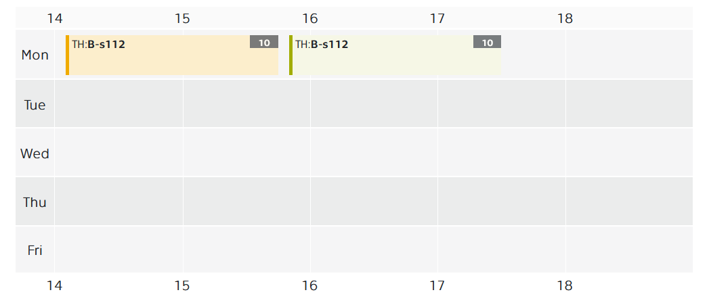

# Geographic Information Systems {: .page_title}

This course will introduce you the basics of __geographic information systems__ (GIS). GIS is a set of tools used to __collect__, __manage__, __analyze__ and __visualize__ geographic data. It allows you to work efficiently with spatial information, which includes __maps__, __satellite images__, __postal addresses__, __topographic data__ and much more. It can perform complex analyses, identify patterns, and thus __better understand geographic phenomena and relationships__.

GIS has a wide range of applications, from __urban planning__ to __natural resource management__ and __crisis management__. It is an indispensable tool for effective decision-making and management in various sectors and helps to better understand complex geographical contexts.

This course is an intro to this topic. While the lectures take you through the basic theory, the practicals focus on the practical use of GIS software - in particular, understanding how to work with data and perform simple analyses. __:simple-arcgis: Esri ArcGIS Pro__{: style="white-space: nowrap;"} software is used throughout the course.

<h2 style="text-align:center;">What will you learn</h2>
<!-- styl je zde pridany HTML tagem (ne pomoci '##'), aby se text neobjevil v tabulce obsahu vlevo na strance -->

 <!-- specificky format gridu (trida "grid_icon_info") na miru uvodni strance predmetu -->

-   :material-map-outline:{ .xl }

    __process__ and __analyze__ spatial (geographic, map) data

-   :material-vector-polygon:{ .xl }

    understand the difference between __vector__ and __raster__ data

-   :material-filter-outline:{ .xl }

    __filter__ data using attribute and spatial queries

-   :material-tools:{ .xl }

    apply basic __spatial functions__ (geoprocessing tools)

-   :material-creation-outline:{ .xl }

    __create__ and __edit__ GIS data

-   :octicons-share-16:{ .xl }

    __share__ data to the web (_ArcGIS Online_ system, web mapping applications)

{: .no-filter }
{: .no-filter }
{: .no-filter }
{: .no-filter }
{: .no-filter }
{: .no-filter }
{: .no-filter }
{: .no-filter }
{: .no-filter }
{: .no-filter }
{: .no-filter }
{: .no-filter }

## Lectures & Practicals {: style="margin-bottom:0;"}

attendance recommended
{: style="opacity:50%;margin-top:0;"}

{: .off-glb .no-filter style="height: 1.5em; vertical-align: -.4em; clip-path: circle();"} 
[__Mgr. Petra Justová, Ph.D.__](https://geomatics.fsv.cvut.cz/en/employees/petra-justova/)__&nbsp;__{style="margin-left:1rem;"}{: .off-glb .no-filter style="height: 1.5em; vertical-align: -.4em; clip-path: circle();"}
[__Ing. Jan Koudelka__](https://geomatics.fsv.cvut.cz/en/employees/jan-koudelka/)__&nbsp;__{style="margin-left:1rem;"}{: .off-glb .no-filter style="height: 1.5em; vertical-align: -.4em; clip-path: circle();"}
[__Ing. Josef Münzberger__](https://geomatics.fsv.cvut.cz/en/employees/josef-munzberger/)

| Date | Topic | Lecturer | Assignment |
| :---: | ----- | :------: | ---------- |
| 21.09. | [Course introduction, ArcGIS Pro basics, spatial data, attribute table](https://k155cvut.github.io/gise/practicals/Introduction) | JM | |
| 28.09. | — no class — | — | — |
| 05.10. | [Map Projections in Detail](https://k155cvut.github.io/gise/practicals/MapProjections) | JK | <a href="https://k155cvut.github.io/gise/practicals/MapProjections/#assignment-01">Assignment 01 · due 18/10</a> |
| 12.10. | [Vector data (attribute and location queries)](https://k155cvut.github.io/gise/practicals/VectorData/) | PJ | <a href="https://k155cvut.github.io/gise/practicals/JoinExternalData/#assignment-02">Assignment 02 · due 25/10</a> |
| 19.10. | [Join external data, Data sources, Spatial join](https://k155cvut.github.io/gise/practicals/JoinExternalData/) | PJ | |
| 26.10. | Geocoding | JM | |
| 02.11. | [Raster data, Georeferencing, Editing and Creating Vector Data](https://k155cvut.github.io/gise/practicals/georeferencing_vectorization/) | PJ | <a href="https://k155cvut.github.io/gise/practicals/georeferencing_vectorization/#assignment-03">Assignment 03 · due 15/11</a> |
| 09.11. | [Geoprocessing tools](https://k155cvut.github.io/gise/practicals/GeoprocessingTools/) | PJ | <a href="https://k155cvut.github.io/gise/practicals/GeoprocessingTools/#assignment-04">Assignment 04 · due 22/11</a> |
| 16.11. | — no class — | — | — |
| 19.11. | Elevation models (DEM, DSM, DTM), Terrain analysis, [Map Algebra](https://k155cvut.github.io/gise/practicals/TerrainAnalysis/) | PJ | <a href="https://k155cvut.github.io/gise/practicals/TerrainAnalysis/#assignment-05">Assignment 05 · due 06/12</a> |
| 23.11. | ArcGIS Online introduction, VTSE, Web App Builders | JM | |
| 30.11. | [Web map services, ArcGIS Online, web mapping applications (part 1)](https://k155cvut.github.io/gise/practicals/WMS_AGOL/) | JM | <a href="https://k155cvut.github.io/gise/practicals/WMS_AGOL/#assignment-06">Assignment 06 · due 13/12</a> |
| 07.12. | [Web map services, ArcGIS Online, web mapping applications (part 2)](https://k155cvut.github.io/gise/practicals/WMS_AGOL/) | JM | |
| 14.12. | Written exam | PJ, JM, JK | |

### **Course conditions**

- submission of all practical assignments (data layer or map (and technical report) in PDF format)
- written exam (min. 50% pts)

## Learning resources
### **Literature**

- Bolstad, P. (2005) GIS Fundamentals: A First Text on Geographic Information Systems. 2nd Edition, Eider Press, White Bear Lake, Minnesota.
- De Smith, M.J., Goodchild, M.F. and Longley, P.A. (2015) Geospatial Analysis A Comprehensive Guide to Principles, Techniques, and Software Tools.
- P. A. Burrough, Rachael McDonnell (1998) Principles of Geographical Information Systems. Oxford University Press.

### **Tutorials**

1. [Learn ArcGIS Hub](https://learn.arcgis.com/en/gallery/#?p=arcgispro)
2. [Esri Training Catalog](https://www.esri.com/en-us/training/catalog/all-training)
3. [MOOCs and Live Training Seminars](https://www.esri.com/en-us/training/catalog/live-training-seminars-moocs)
4. [Urban Planning, Design & Development Software](https://www.esri.com/en-us/arcgis/products/arcgis-urban/overview)

---

## Schedule {: style="margin-bottom:0;"}

winter semester 2026/2027
{: style="opacity:50%;margin-top:0;"}

[{.off-glb .no-filter style="width: 600px;"}](https://kos.cvut.cz/schedule/course/155GISE/semester/B261){target="_blank"}

---

[Course page in :custom-kos-logo-img-BW:{.middle style="margin-left:3px;"} :custom-kos-logo-BW:{.xl .middle}](https://kos.cvut.cz/course-syllabus/155GISE/B251 "KOS is the official university administration system"){ .md-button .md-button--primary target="_blank"}
{align=center}

 