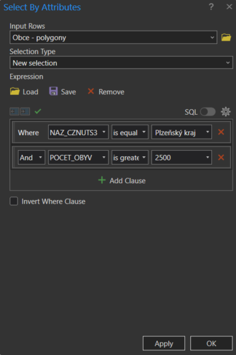
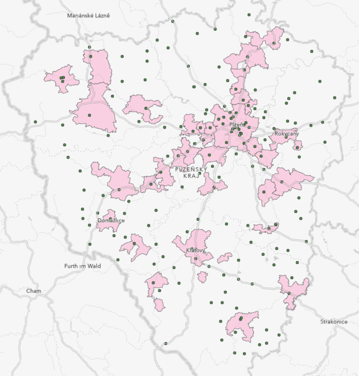

# Prostorové funkce (geoprocessing), spatial join

## Cíl cvičení

Seznámení se se základními geoprocessingovými nástroji v GIS v rámci řešení komplexní úlohy.

## Základní pojmy

- [**buffer**](https://pro.arcgis.com/en/pro-app/latest/tool-reference/analysis/buffer.htm): Vytváří zóny okolo vstupních geografických prvků ve specifikované vzdálenosti. Tyto zóny mohou být využity například k analýze vlivu určitého objektu na své okolí.
- [**clip**](https://pro.arcgis.com/en/pro-app/latest/tool-reference/analysis/clip.htm): Vyřezává část jednoho datasetu na základě hranic jiného. Výsledkem je nový dataset obsahující pouze oblasti uvnitř klipu.
- [**select**](https://pro.arcgis.com/en/pro-app/latest/tool-reference/analysis/select.htm): Umožňuje vybrat prvky z datasetu, které splňují zadané podmínky, například atributové dotazy nebo prostorové kritérium.
- [**intersect**](https://pro.arcgis.com/en/pro-app/latest/tool-reference/analysis/intersect.htm): Kombinuje dvě nebo více vstupních vrstev a vytváří nové prvky v místech, kde se jejich geometrie překrývají.
- [**dissolve**](https://pro.arcgis.com/en/pro-app/latest/tool-reference/analysis/dissolve.htm): Agreguje prvky podle specifického atributu, čímž redukuje počet prvků a vytváří větší jednotky (např. sloučení polygonů stejného typu).
- [**spatial join**](https://pro.arcgis.com/en/pro-app/latest/tool-reference/analysis/spatial-join.htm): Kombinuje atributy dvou geografických vrstev na základě jejich prostorového vztahu (např. připojení údajů bodů k blízkým polygonům).
- [**erase**](https://pro.arcgis.com/en/pro-app/latest/tool-reference/analysis/erase.htm): Odstraňuje části jedné vrstvy, které se překrývají s druhou vstupní vrstvou, a ponechává zbytek geometrie.
- [**union**](https://pro.arcgis.com/en/pro-app/latest/tool-reference/analysis/union.htm): Kombinuje geometrie a atributy dvou nebo více vrstev do nové vrstvy. Výsledkem jsou oblasti, které reprezentují kombinaci všech vstupů.
- [**remove overlap**](https://pro.arcgis.com/en/pro-app/latest/tool-reference/analysis/remove-overlap-multiple.htm): Identifikuje a odstraňuje překrývající se oblasti mezi prvky v jedné vrstvě nebo mezi více vrstvami.
- [**symmetrical difference**](https://pro.arcgis.com/en/pro-app/latest/tool-reference/analysis/symmetrical-difference.htm): Vytváří novou vrstvu obsahující prvky, které jsou v jedné nebo druhé vstupní vrstvě, ale ne v jejich překryvu.
- [**count overlapping features**](https://pro.arcgis.com/en/pro-app/latest/tool-reference/analysis/count-overlapping-features.htm): Počítá počet prvků, které se překrývají, a výsledek ukládá do nové vrstvy nebo atributové tabulky.

Následující přehled ukazuje nejpoužívanější nástroje prostorových funkcí v ArcGIS Pro.

<figure markdown>
  
  <figcaption>Srovnání vstupních vrstev a výsledků operace pro různé nástroje prostorových funkcí</figcaption>
</figure>

## Použité datové podklady

- [Pobočky](../assets/cviceni3/PobockyCP_PlzenskyKraj.zip) České pošty v Plzeňském kraji (bodová vrstva)
- Obce ČR ([ArcČR 500](../../data/#arccr-500), polygonová vrstva)

## Náplň cvičení

Představte si, že pracujete jako GIS analytik pro Českou poštu a vaším úkolem je z důvodu úspor navrhnout řešení snížení počtu poboček. Snahou tohoto kroku je však i minimalizace negativních dopadů na obyvatele, proto bylo rozhodnuto o následujících podmínkách, které musíte ve svém návrhu dodržet:

1. Rušení poboček nebude probíhat v obcích s méně než 2500 obyvateli.
2. V obcích nad 2500 obyvatel neklesne počet poboček pod 1.
3. Vzájemná vzdálenost poboček v jedné obci nebude nižší než 3 km vzdušnou čarou.

Jakou finanční úsporu jste schopni svým návrhem zajistit, pokud by provoz jedné pobočky vycházel ročně na 2,5 milionu CZK? Pro zjednodušení budete úlohu řešit pouze v rámci Plzeňského kraje a ke každé pobočce přistupovat rovnocenně.

## Pracovní postup

**1.** Výběr obcí v Plzeňském kraji s více než 2500 obyvateli (atributový dotaz) a tvorba samostatné vrstvy selektovaných prvků.

<figure markdown>
  
  <figcaption>Atributový dotaz na vrstvu obcí</figcaption>
</figure>

**2.** Výběr typu pobočky zavedením *Definition Query* (výraz: ZKRNAZ_DRU = 'pošta').

<figure markdown>
  
  <figcaption>Definition Query pro vrstvu poboček pošty</figcaption>
</figure>

<figure markdown>
  
  <figcaption>Vizualizace stavu nad podkladovou mapou</figcaption>
</figure>

**3.** Spatial join: k výběru obcí připojíme pobočky na základě jejich polohy. Zároveň přidáme nový atribut POCET_POBOCEK, který bude určen na základě sumy libovolného ze stávajících atributů vrstvy poboček (např. count(GmIID)).

<figure markdown>
  
  <figcaption>Spatial join</figcaption>
</figure>

**4**. Následně zadáme atributový dotaz na vrstvu obcí, který vybere prvky s více než 1 pobočkou (POCET_POBOCEK *is greater than* 1).

<figure markdown>
  
  <figcaption>Atributový dotaz na vrstvu obcí</figcaption>
</figure>

**5**. V dalším kroku použijeme nástroj *CLIP* a vytvoříme novou vrstvu obsahující takové pobočky pošty, které se nacházejí v obcích s více než 1 pobočkou. Tím, že v předchozím kroku byla provedena selekce pouze některých prvků z vrstvy obcí, do funkce *CLIP* vstoupí pouze tento aktivní výběr.

<figure markdown>
  
  <figcaption>Oříznutí vrstvy poboček aktivními prvky ve vrstvě obcí.</figcaption>
</figure>

<figure markdown>
  
  <figcaption>Vizualizace stavu po ořezu.</figcaption>
</figure>

**6**. S využitím nástroje *BUFFER* vytvoříme obalovou zónu kolem každé pobočky o poloměru 3 km.

<figure markdown>
  
  <figcaption>Parametry nástroje BUFFER pro tvorbu obalové zóny (rádius 3 km)</figcaption>
</figure>

**7**. Nyní přistoupíme k vizuálnímu vyhodnocení poboček vhodných ke zrušení. Např. v Klatovech lze při dodržení zadaných kritérií zrušit právě 2 pobočky České pošty (zvýrazněné včetně svých obalových zón), resp. zachovat maximálně 2 pobočky (viz níže).

<figure markdown>
  { width="500" }
  <figcaption>Příklad poboček aspirujících na zrušení</figcaption>
</figure>

**8**. V atributové tabulce poboček vytvoříme pomocí *Add Field* pomocný atribut RUSENO (datový typ *short*, defaultní hodnota 0).

<figure markdown>
  
  <figcaption>Přidání nového pole do atributové tabulky</figcaption>
</figure>

**9**. Manuálně vybereme (pomocí *Select*) pobočky vyhovující kritériím zrušení změnou hodnoty atributu RUSENO na 1.

**10**. Nyní je možné zobrazit rušené pobočky zavedením *Definition Query* (výraz RUSENO = 1) nebo naopak pobočky splňující podmínky, aby byly zachovány (výraz RUSENO = 0).

<figure markdown>
  
  <figcaption>Pobočky pošty, kterou mohou být zachovány.</figcaption>
</figure>

**11**. Závěrem lze porovnat, jak rušení poboček České pošty v r. 2023 skutečně proběhlo; přehled naleznete např. [zde](https://www.seznamzpravy.cz/clanek/fakta-ceska-posta-zrusene-pobocky-seznam-mapa-231064). Celý problém je samozřejmě složitější, jelikož finální výběr ovlivnily další faktory jako priorita pobočky (hlavní vs. vedlejší), bezbariérovost, apod.

## Domácí úloha: Kulturní míle

*Pracovní postup:*

1.  Stáhněte si prostorová data (z OSM přes BBBike): Vyberte ohraničení kolem vaší univerzity (cca 2 km^2^), vyplňte formát, jméno a mail a stiskněte *Extract*. Odkaz na stažení vám bude zaslán na vaši e-mailovou adresu, jakmile bude proces online extrakce hotový.

2.  Načtěte a vyberte data v aplikaci ArcGIS Pro: Do mapy importujte shapefile *points.shp*. Prozkoumejte atributovou tabulku, zejména pole *type*. Najděte a vyberte bod představující vaši univerzitu.

3.  Prostorová analýza (část 1): Po výběru bodu (vaší univerzity) vytvořte pomocí geoprocessingového nástroje *Buffer* (metoda *planar*) kolem tohoto bodu obalovou zónu o velikosti 1 míle. Funkce zpracuje pouze 1 obalovou zónu kolem vybraného bodu, pokud je výběr aktivní.

4.  Atributový dotaz: Proveďte *Select by Attributes* a vyhledejte body související s kulturou pomocí atributu *typ* (vyhledávání divadel, muzeí atd.). Vyberte všechny prvky v nejméně 5 různých kategoriích kultury a extrahujte tato data do geodatabáze projektu.

5.  Prostorová analýza (část 2): Pomocí nástroje *Clip* extrahujte body (vrstva prvků obsahující pouze kulturní místa) v rámci mílové obalové zóny.

6.  V této fázi byste měli mít kolem univerzity  zónu o velikosti 1 míle obsahující body zájmu související s kultury. Všechny ostatní prvky můžete z mapy odstranit.

7.  Najděte vhodné symboly pro jednotlivé typy kulturních zařízení.

8.  Vložte nový layout (*Insert Layout*) ve vybraném formátu a zvolte orientaci na šířku nebo na výšku.

9.  Ve vlastnostech mapy nastavte vhodné referenční měřítko a případně omezte obsahu mapového okna pouze na obalovou zónu.

10. Dokončete rozvržení: vložte mapové okno, přidejte nadpis, podnadpis, legendu a tiráž. Níže inspirace.

<figure markdown>
  { width=600px }
  <figcaption>Výsledná vizualizace</figcaption>
</figure>

## Úlohy k procvičení

!!! task-fg-color "Úlohy"

    K řešení **následujích** úloh použijte datovou sadu [ArcČR
    500](../../data/#arccr-500) verzi 3.3 dostupnou na disku *S* ve složče
    ``K155\Public\data\GIS\ArcCR500 3.3``. Zde také **najdete** souboru s
    popisem dat ve formátu PDF.

    1. Jaká je výměra (v ha) bažin a rašelinišť ležících v lese. Kolik to
       je procent z celkové výměry bažin a rašelinišť?
       
    2. Jaká je výměra (v km^2^) území omezeného pouze na ČR do 100 m od dálnic?

    3. Kolik obcí v ČR leží celou svojí plochou do vzdálenosti 10 km od
       řeky Labe. Jaký je celkový počet obyvatel těchto obcí?

    4. Na kolika místech kříží dálnice, rychlostní silnice či silnice
       1.třídy s železnicí. Kolik z těchto křížení leží do vzdálenosti 1km
       od nejbližší železniční stanice?

    5. Jaká je výměra území (v ha), na kterých leží les či vodní
       plocha. Existuje území, které by odpovídalo současně oběma
       podmínkám?

    6. Vytvořte společnou datovou vrstvu pro letiště a železniční
       stanice. Kolik objektů tato vrstva obsahuje?

    7. Kolik procent z celkové výměry ČR činí uzemí, která jsou vzdálená
       od nejbližšího rybníku více než 25 km?

    8. Jaká je výměra uzemí ČR (v km^2^), která leží dále než 5 km od
       nejbližší silnice a zároveň dále než 10 km od nejbližší železniční
       stanice? Na území kterých obcí leží největší z hledaných lokalit?

    9. Kolik procent území Jihočeského kraje tvoří vodní plochy?
