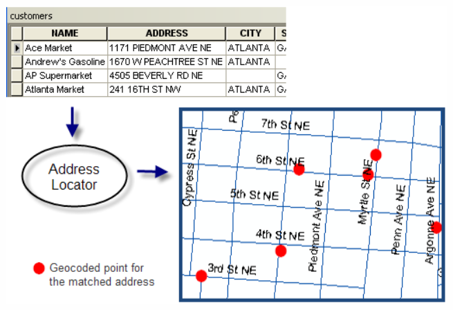
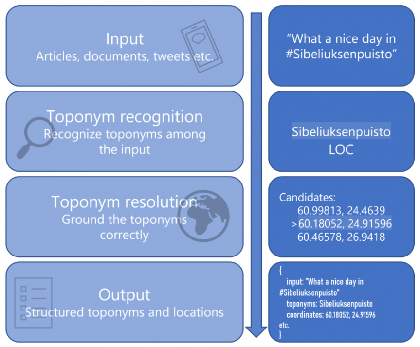
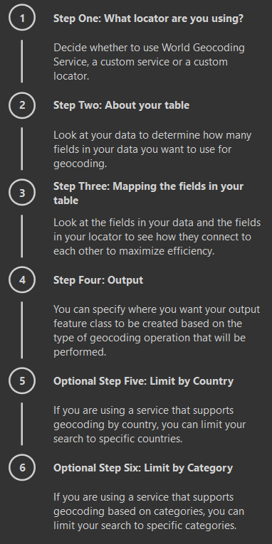
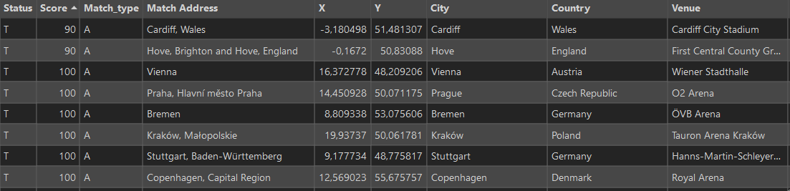
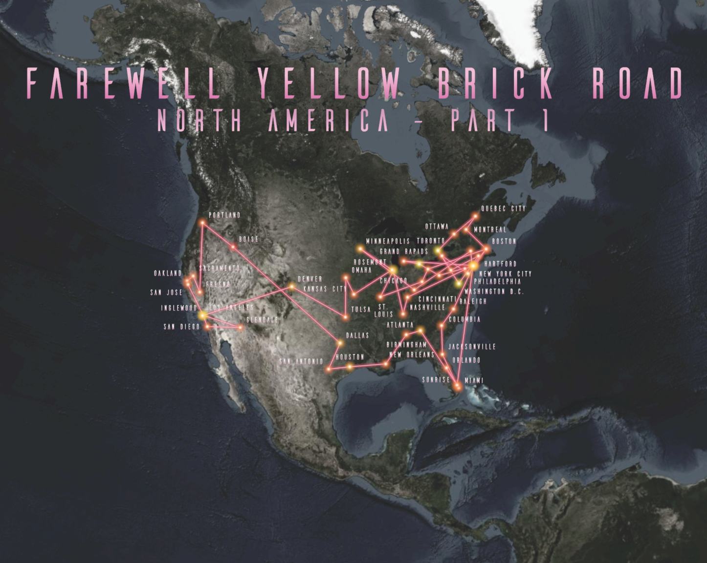

# Geocoding

**Spatial data** is any type of data that directly or indirectly references a specific geographical area or location. A location can be represented not only by a combination of coordinates (X + Y, latitude + longitude, etc.), but also by, for example, an address (of arbitrary detail). The two most common data formats used to store (geo)spatial data are vector and raster.

Finding places on a map is an integral part of a GIS. **Geocoding** is the process of transforming a description of a location (such as a pair of coordinates, an address, or a name of a place) to a location on the earth's surface. You can geocode by providing one location description at a time to zoom to a location on a map or convert an entire table that can be used for spatial analysis. When you *geocode* a table of addresses, you use a locator to create point features that represent the locations of the addresses.

<figure markdown>
{ width=400px }
    <figcaption>Geocoding process [*(ArcMap, 2025)*](https://desktop.arcgis.com/en/arcmap/latest/manage-data/geocoding/geocoding-a-table-of-addresses-about.htm)</figcaption> 
</figure>

__Resources:__
{: align=center }

[pro.arcgis.com Geocoding in ArcGIS Pro](https://pro.arcgis.com/en/pro-app/latest/help/data/geocoding/convert-a-table-to-locations-on-the-map.htm){ .md-button .md-button--primary .server_name .external_link_icon_small target="_blank"}
[pro.arcgis.com Rematch geocoded locations](https://pro.arcgis.com/en/pro-app/latest/help/data/geocoding/rematch-locations-converted-from-a-table.htm){ .md-button .md-button--primary .server_name .external_link_icon_small target="_blank"}
{: .button_array}

???+ note-grey "Geoparsing"

    Geoparsing is a special toponym resolution process of converting free-text descriptions of place names (such as "twenty miles northeast of Paris") into unambiguous geographic identifiers, such as geographic coordinates expressed as latitude-longitude. It is a sofisticated task consisting of two main steps. First one is identifying place names in text (toponym recognition, or named entity recognition for place names). This is the task of identifying place names in text, such as “Paris” or “Aleppo”.
    Second one is resolving place names to their geographic coordinates or entry in a gazetteer of place names (toponym resolution). This main difficulty in this step is handling ambiguous place names: “Aleppo” could refer to the city in Syria, the governorate in Syria, or the township in Pennsylvania.
    
     
    <figure markdown>
    { width=400px }
    <figcaption>Geoparsing process [*(Leppämäki, 2022)*](https://blogs.helsinki.fi/digital-geography/2022/05/16/geoparsing-how-to-gain-location-information-from-finnish-texts/)</figcaption> 
    </figure>

<source src="../assets/Geocoding/Elton.mp4" type="video/mp4">

## Assignment 05
!!! abstract "My favourite artist tour"
    **TASK:**

    Make a map showing the tour of your favourite artist on a selected continent in one year. Your map should display following information:
    
    - all the locations that the artist visited during the tour
    - the total revenue from concerts in a given location

     
    **DATA SOURCES:**
    
      [:material-table: artist's tour on Wikipedia](https://en.wikipedia.org/wiki/Farewell_Yellow_Brick_Road){ .md-button .md-button--primary .button_smaller }
      {: .button_array style="justify-content:flex-start;"}
    
    
    **SUBMISSION FORM:**

    - 1 map in PDF format (submit by 16/03, send to <a href="mailto:petra.justova@fsv.cvut.cz">petra.justova@fsv.cvut.cz</a>)
    
     
    **INSTRUCTIONS:**
    
    **Step 1:** **Data processing**

    - Pick one of your favourite artists and search the Wikipedia for one of his/her tours.  
    *(If you are not into music, you can use [Farewell Yellow Brick Road tour](https://en.wikipedia.org/wiki/Farewell_Yellow_Brick_Road) by Elton John for this task.)*
    - Import data to MS Excel, edit the table and save it in .xlsx format.   
    *(Limit the tour extent to one continent and one year (e.g. Europe in 2019). If there was more than one concert in a city, edit "Date" field to show the date range (or all dates separately) and edit "Revenue" field (add the revenue of all concerts in a given city), so there is only one record for each city.)*
        
         

        { width=400px }
        { width=400px }
        {: .process_container}

         
    - Import the table to ArcGIS Pro --> use *Excel To Table* tool
    - Right-click the table and select *Geocode Table*. Follow the geocoding guide (do not forget to estimate the credits at the end and run the tool).

         
        <figure markdown>
        { width=200px }
        <figcaption>Geocoding guide in ArcGIS Pro</figcaption> 
        </figure>

    - If there are any *unmatched* results or *matched*/*tied* results with low precision *(Score)*, use the interactive *Rematch* tool to make corrections to your original input *(Data-Rematch Addresses)*.

    ??? tip "Checking the geocoding results"
        There could be several results for geocoded addresses with different precision *(Score)*:
            
        - Matched (M)
        - Tied (T) - *The address has more than one candidate with the same best match score but at different locations.*
        - Unmatched (U)

             
            <figure markdown>
            { width=800px }
            <figcaption>Geocoding guide in ArcGIS Pro</figcaption> 
            </figure>
        
        If you find that not all of the addresses or locations in your table were matched to the results you expected (e. g. points may not have been created in the location you expected or may lack the precision you were expecting). Inspect the table of the geocoded feature class to reveal the reason for an unexpected match (e.g. missing a city field in input, misspelled street name, etc.). For cases such as these, you can review the results, make corrections in your table, and update your geocoding results. You can use the interactive rematch tool in ArcGIS Pro to manually review addresses to make corrections to your original input and geocode again, reposition the location of the matched address, or select a different candidate. You can also modify the locator's settings and geocode the addresses that were matched to unexpected results. This process is called rematching.
     
    **Step 2:** **Data visualization**

    - Insert *New Layout* and place the *Map Frame*  
    *(choose any format in any orientation, you can also customize the page size and create a square-shaped format, for example)*
    - Set the proper scale of the map  
    *(Use Zoom to Layer to center the map frame on the area of interest, then round the map scale. You can also activate the map frame and move the map content manually.)*
    - In *Map Properties* set *the Reference scale* to your chosen map scale.
    - Find appropriate symbols to represent the location of cities and choose a suitable base map.  
    *(Use advanced symbology like proportional symbols or graduated colors to display the total revenue from concerts in a given city)*
    - Label each location with its name and with the date of the concert  
    *(Try to use an Arcade expression, e.g. ``$feature.PlaceName +TextFormatting.NewLine+"<FNT size='8'>"+"("+$feature.USER_Date+")"+"</FNT>"``)*
    - Finish the layout: insert *Map Title*, *Scale*, *Legend* and *Credits*. Feel free to make it nice! You can see an inspiration for your output below.  
    *(If you are not satisfied with the symbols offered in default [styles](https://pro.arcgis.com/en/pro-app/latest/help/projects/styles.htm), you can create your own symbol or use one of the [user-created styles](https://esri-styles.maps.arcgis.com/home/index.html).)*
    - Export *Layout* in PDF Format

     
    { width=800px }
    {: align=center}

    