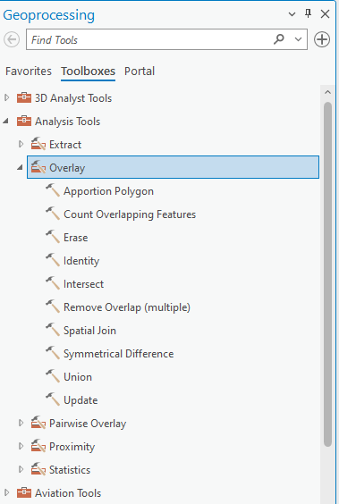
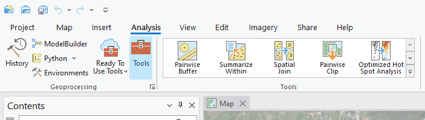
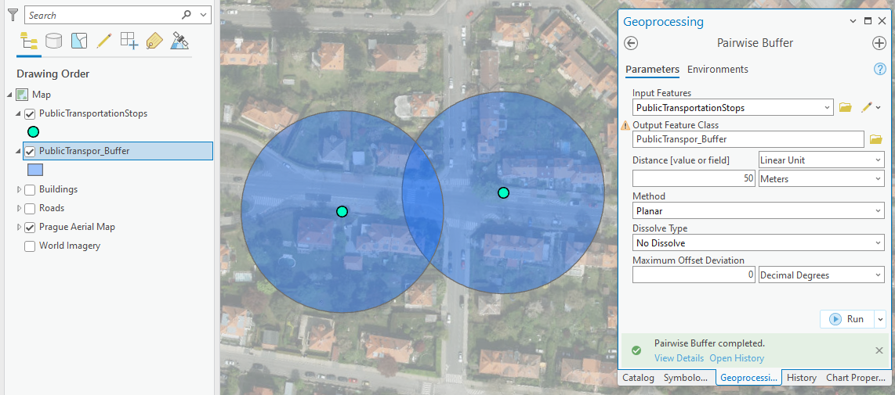

# Geoprocessing tools

**Geoprocessing tools** in ArcGIS Pro are essential functions used to perform spatial analysis and data management tasks. They allow users to process geographic data through operations ranging from basic operations like [***spatial overlaying***](https://pro.arcgis.com/en/pro-app/latest/tool-reference/analysis/an-overview-of-the-overlay-toolset.htm) to advanced analyses such as [***terrain modeling***](https://pro.arcgis.com/en/pro-app/latest/help/data/terrain-dataset/terrain-dataset-in-arcgis-pro.htm). Each tool takes input data, applies a specific operation, and produces an output dataset that can be visualised or used for further analysis. Tools can be run individually from the [***Geoprocessing pane***](https://pro.arcgis.com/en/pro-app/latest/help/analysis/geoprocessing/basics/find-geoprocessing-tools.htm) or combined into automated workflows using [***ModelBuilder***](https://pro.arcgis.com/en/pro-app/latest/help/analysis/geoprocessing/modelbuilder/what-is-modelbuilder-.htm) or [***Python scripts***](https://pro.arcgis.com/en/pro-app/latest/arcpy/geoprocessing_and_python/using-tools-in-python.htm). Geoprocessing is at the core of spatial problem solving, helping users transform raw geographic data into meaningful information and to reveal valuable insights by uncovering previously unseen spatial patterns and relationships.

## Basic geoprocessing tools

- [**buffer**](https://pro.arcgis.com/en/pro-app/latest/tool-reference/analysis/buffer.htm){:target="_blank"}: Creates zones around input geographic features at a specified distance. These zones can be used, for example, to analyse the influence of a given feature on its surroundings. 
- [**clip**](https://pro.arcgis.com/en/pro-app/latest/tool-reference/analysis/clip.htm){:target="_blank"}: Extracts portions of one dataset based on the boundaries of another. The output dataset contains only the areas within the clip extent.
- [**select**](https://pro.arcgis.com/en/pro-app/latest/tool-reference/analysis/select.htm){:target="_blank"}: Allows you to select features from a dataset that meet specified conditions, such as attribute queries or spatial criteria.
- [**merge**](https://pro.arcgis.com/en/pro-app/latest/tool-reference/data-management/merge.htm){:target="_blank"}: Combines multiple input datasets into a single new output dataset. This tool can merge point, line, or polygon feature classes or tables.
- [**intersect**](https://pro.arcgis.com/en/pro-app/latest/tool-reference/analysis/intersect.htm){:target="_blank"}: Combines two or more input layers and creates new features where their geometries overlap.
- [**dissolve**](https://pro.arcgis.com/en/pro-app/latest/tool-reference/analysis/dissolve.htm){:target="_blank"}: Aggregates features based on a specified attribute, reducing the number of features and creating larger units (e.g. merging polygons of the same type).
- [**spatial join**](https://pro.arcgis.com/en/pro-app/latest/tool-reference/analysis/spatial-join.htm){:target="_blank"}: Combines attributes of two geographic layers based on their spatial relationship (e.g. attaching point data to nearby polygons).
- [**erase**](https://pro.arcgis.com/en/pro-app/latest/tool-reference/analysis/erase.htm){:target="_blank"}: Removes areas of one layer that overlap with another input layer, leaving only the remaining geometry.
- [**union**](https://pro.arcgis.com/en/pro-app/latest/tool-reference/analysis/union.htm){:target="_blank"}: Combines the geometries and attributes of two or more layers into a new layer. The result includes areas representing the combination of all inputs.
- [**remove overlap**](https://pro.arcgis.com/en/pro-app/latest/tool-reference/analysis/remove-overlap-multiple.htm){:target="_blank"}: Identifies and removes overlapping areas between features within a single layer or among multiple layers.
- [**symmetrical difference**](https://pro.arcgis.com/en/pro-app/latest/tool-reference/analysis/symmetrical-difference.htm){:target="_blank"}: Creates a new layer containing features that are in either one or the other input layer, but not in their overlap.
- [**count overlapping features**](https://pro.arcgis.com/en/pro-app/latest/tool-reference/analysis/count-overlapping-features.htm){:target="_blank"}: Counts the number of overlapping features and stores the result in a new layer or attribute table.

<figure markdown>
  
  <figcaption>Comparison of input layers and operation results for different spatial analysis tools</figcaption>
</figure>
 

## Using geoprocessing tools

### Geoprocessing pane

In ArcGIS, a toolbox is a container for organizing and storing geoprocessing tools. It's a way to organize and manage various geoprocessing tools and models in a structured manner. Toolboxes can be thought of as folders that hold a collection of related tools, scripts, and models, making it easier to locate and use them efficiently.

{ .no-filter .off-glb }
{: align=center}

### Batch Processing

Batch processing in ArcGIS is a time-saving technique where the same geoprocessing operation is applied to multiple datasets simultaneously.

{ .no-filter .off-glb }
{: align=center}

### ModelBuilder

ModelBuilder is a visual programming environment that allows users to create, edit, and manage workflows by stringing together a sequence of geoprocessing tools and operations. It provides a graphical interface for designing and automating complex geospatial analyses, making it easier for users to conceptualize, build, and share spatial models.

{ .no-filter .off-glb }
{: align=center}

### Python

Python can be used to automate the execution of geoprocessing tools as well as provide the ability to create your own geoprocessing tools, either as a script tool or as a Python toolbox tool.

{ .no-filter .off-glb }
{: align=center}

## Assignment 04
!!! abstract "Noise map of Czechia"
    **TASK:**

    Make a map showing two types of noise zones in Czechia.

    Within Czechia, define areas of high and increased noise zones, according to the following criteria:

    1. high-noise zone
    
        - within a distance of 10 km from an airport
        - within a distance of 3 km from highways

    2. increased-noise zone
    
        - at a distance of 10–20 km from an airport
        - at a distance of 3–6 km from highways

    <figure markdown>
      { width=600px }
      <figcaption>Noise map of Czechia</figcaption>
    </figure>

     
    In technical report answer following questions:
    
    - What proportion of Czechia (in %) lies within the high-noise zone?
    - What proportion of Czechia (in %) is affected by noise from both roads and airports?
    - What proportion of Czechia (in %) lies within the normal-noise zone?

     
    **DATA SOURCES:**
    
      [:material-download: Data for noise map :material-layers:](../assets/Geoprocessing/data.zip){ .md-button .md-button--primary .button_smaller }
        {: .button_array style="justify-content:flex-start;"}

         
    **SUBMISSION FORM:**

    - technical report + map in PDF format (submit by 23/11, send to <a href="mailto:petra.justova@fsv.cvut.cz">petra.justova@fsv.cvut.cz</a>)

    [:material-download: Technical report template :material-layers:](../assets/cviceni2/technical_report.doc){ .md-button .md-button--primary .button_smaller }
      {: .button_array style="justify-content:flex-start;"}
    

    **INSTRUCTIONS:**

    - Create buffers around airports and roads according to the specified criteria *(Buffer)*
    - Create a layer in which noisy areas are geometrically distinguished by noise level (increased vs. high) and by noise source (roads vs. airports vs. roads + airports) *(Union, Dissolve)*
    - Clip layers to the boundaries of Czechia *(Clip)*
    - Set the symbolization of all layers properly. 
    - In *New Layout* (A4 Landscape) insert the Map Title, Scale and Credits.
    - Export *Layout* in PDF Format

<!--
## Workflow

### Where to find it

Geoprocessing is the engine of ArcGIS Pro which means that the geoprocessing tools are integrated in various locations throughout the software.

#### Analysis Tools Gallery

Analysis Tools gallery higlights the most used spatial analysis tools.

{ .no-filter .off-glb }
{: align=center}

#### Geoprocessing pane

Geoprocessing pane opens from the Tools button in Geoprocessing Group inside Analysis tab. To locate geoprocessing tools, simply type a search phrase into the search bar at the top of the Geoprocessing pane. Whether you know the tool's name or are describing the operation you need, this search feature helps you find the right geoprocessing tool efficiently.

{ .no-filter .off-glb }
{: align=center}

 ### Run the geoprocessing tool

After choosing a specific geoprocessing tool, a configuration interface opens. After filling the required parameters indicated by the red asterix, the Run button is activated. When a tool is run, a progress bar is displayed in the Geoprocessing pane where you can view tool progress and messages. After finishing a specific symbol indicating Success, Warning or Error appears. When the tool is finished running, the output layer is added to the active map.

{ .no-filter .off-glb }
{: align=center}

### Geoprocessing history

Every time you run a geoprocessing tool, a new entry is added in the History pane under the Geoprocessing tab.
By hovering over the tool entry, information about the tool's execution and messages appears. You can also double-click the entry to reopen the tool with the same parameter values.

{ .no-filter .off-glb }
{: align=center}

## Task

### Objective

Identify a suitable location for a new bus stop in Prague, considering specific criteria to optimize accessibility and convenience.

### Data

- Public transport stops
- Roads
- Buildings

_Data source: [Geoportal Praha](https://geoportalpraha.cz/ "Prague geographic data in one place")._

### Requirements

#### Proximity to Big Roads:

- Analyze the road data to identify major roads.
- Use a geoprocessing tool make a buffer of **5 meters** to make sure the bus can pass through the street.

#### Distance from Other Public Transport Stops:

- Analyze the public transport stops data.
- Ensure the selected location for the new bus stop is at least **300 meters** away from any existing public transport stop.

#### Proximity to Buildings:

- Analyze the buildings data.
- Ensure the selected location has at least **50 buildings** within a **100-meter radius**.

### _Bonus_

Create a ModelBuilder that allows you to run the same analysis with different parameters and evaluate their impact. -->
