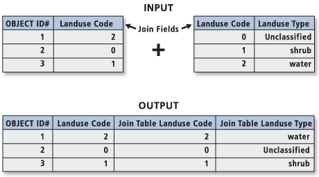
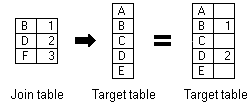
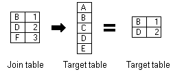

# Join, spatial join

## Basic terms
Through a common field, known as a <strong>key</strong>, you can associate records in one table with records in another table. For example, you can associate a table of parcel ownership information with the parcels layer, because they share a parcel identification field. You can make these associations in several ways. Joins can also be based on spatial location.

Joins information are stored in the layer's properties, so they can be applied only to tables that are opened from a map or scene. To access join information, right-click the layer and click *Properties* to open the *Layer Properties* dialog box, and click the *Joins* tab.

__Resources:__
{: align=center }

[pro.arcgis.com Join the attributes from a table](https://pro.arcgis.com/en/pro-app/latest/help/data/tables/joins-and-relates.htm#GUID-39C9610A-6A73-4985-ADB8-7354EA9DB8BF){ .md-button .md-button--primary .server_name .external_link_icon_small target="_blank"}
[pro.arcgis.com Join data by location (spatially)](https://pro.arcgis.com/en/pro-app/latest/help/data/tables/joins-and-relates.htm#GUID-7B11EAA4-35E0-4B8D-AFB6-4A435761574B){ .md-button .md-button--primary .server_name .external_link_icon_small target="_blank"}
[learn.arcgis.com Remove join](https://pro.arcgis.com/en/pro-app/latest/help/data/tables/joins-and-relates.htm#ESRI_SECTION1_6507320BCB1E45219A88F1AA0A24F7B9){ .md-button .md-button--primary .server_name .external_link_icon_small target="_blank"}
{: .button_array}

### Join the attributes from a table
Typically, you'll join a table of data to a layer based on the value of a field that can be found in both tables. The name of the field does not have to be the same, but the data type must be the same; you join numbers to numbers, strings to strings, and so on. You can perform a join using the *Add Join* geoprocessing tool. When performing an attribute join, the joined fields are dynamically added to the existing table. Field properties (such as aliases, visibility, and number formatting) are maintained when a join is added or removed.

{ .no-filter .off-glb}
{: align=center}

!!! note-grey "Note"

    When joining tables, the default option is to **keep all records**. If a record in the target table doesn't have a match in the join table, that record is given null values for all the fields being appended into the target table from the join table.

    { .no-filter .off-glb}
    {: align=center}

    With the **keep only matching records** option, if a record in the target table doesn't have a match in the join table, that record is removed from the resultant target table. If the target table is the attribute table of a layer, features that don't have data joined to them are not shown on the map.

    { .no-filter .off-glb}
    {: align=center}

### Join data by location spatially
When the layers on your map don't share a common attribute field, you can join them using the *Spatial Join* geoprocessing tool, which joins the attributes of two layers based on the location of the features in the layers.

With a spatial join, you can complete any of the following common workflows:

* Find the nearest feature
* Find what is inside a polygon
* Find what intersects a feature

Join by location, or spatial join, uses spatial associations between the layers involved to append fields from one layer to another. Depending on the type of association, you can append the attributes or an aggregate (minimum, maximum, mean, and so on) of numeric attributes from a matched feature to the target features. Spatial joins by default are different from attribute-driven joins in that they are **not dynamic** and require you to save the results to a new output layer.

### Remove join
To remove a join, use one of the previously mentioned methods to access the *Joins* menu items, and open the *Remove Join* tool. You can use the menu on an open attribute table, the *Data* tab for a layer or stand-alone table selected in the *Contents pane*, or the *Joins and Relates* context menu.

From the *Joins* menu, you can also choose to remove all joins. This command asks you to confirm the action, because you cannot undo removing all joins.

## Assignment 02
!!! abstract "Vector data selections and joins"
    **TASK:**

    Edit prepared data using learned tools.
    
     

    Create three Shapefiles
    
    - Selected river (Line layer)
    - Countries through which this river passes (Polygon layer)
    - Cities in your countries (Point layer)

     

    Create technical report
    
    
    ??? tip "Workflow"
        A. Join
            1. Download prepared data, which include a geodatabase and a shapefile. Connect the geodatabase to your project and add country polygon feature layer and country table to the map.
            2. Join data from table to data in polygon feature layer. (Add Join)
        B. Attribute Query
            1. Add Rivers layer from geodatabase
            2. Choose one river that flows through at least two countries.
            3. Remove all other rivers (Select by Attributes)
        C. Spatial Query
            1. Select all the countries through which this river passes. (Select by Location)
            2. Delete all other countries. (Select by Location)
            3. Add Cities layer from geodatabase.
            4. Select all cities in your countries. (Select by Location)
            5. Delete all other cities. (Select by Location)
        D. Spatial Join
            1. Join Name from countries into cities. (Spatioal Join)
        E. Share Data
            1. Save data as Shapefile (Feature Class To Shapefile)
            2. Make ZIP file with data

     
    **DATA SOURCES:**
    
      [:material-download: DATA :material-layers:](../assets/cviceni5/data_new.zip){ .md-button .md-button--primary .button_smaller }
        {: .button_array style="justify-content:flex-start;"}

         
    **SUBMISSION FORM:**

    - technical report + ZIP file with data (submit by 26/10, send to <a href="mailto:petra.justova@fsv.cvut.cz">petra.justova@fsv.cvut.cz</a>)

    [:material-download: Technical report template :material-layers:](../assets/cviceni2/technical_report.doc){ .md-button .md-button--primary .button_smaller }
      {: .button_array style="justify-content:flex-start;"}
    

__Supplemental exercise:__
{: align=center }

[learn.arcgis.com Join tabular data to a spatial layer](https://learn.arcgis.com/en/projects/join-tabular-data-to-a-spatial-layer/){ .md-button .md-button--primary .server_name .external_link_icon_small target="_blank"}
{: align=center}
  