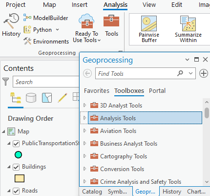
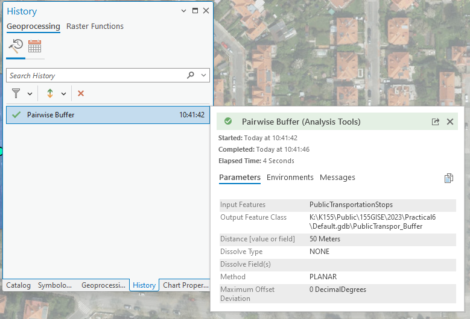

# Web map services, ArcGIS Online

## Web map services

**Web map services** are **online tools that deliver geospatial data** from a server to a client over the internet. The client—usually a web or desktop GIS application—sends requests for data and displays the returned information in a map window. Thanks to the shared coordinate system, users can combine data from different sources and scales in a single map.

{ .no-filter width=700px}
{align=center}

There are several communication **standards for web map services**:

- [OGC]("Open Geospatial Consortium") open standards: 
    - __WMS (Web Map Service)__ is a standard protocol for serving geospatial data as images (e.g., PNG, JPEG) over the web. It allows clients to request maps and map layers from a server and display them on a map viewer or client application. 
    - __WFS (Web Feature Service)__ refers to a standard protocol for serving geospatial data as vector features (e.g., points, lines, polygons) over the web. It allows clients to request specific feature data from a server and perform operations on the data, such as querying, inserting, updating, and deleting features.

- [Esri]("ESRI (Environmental Systems Research Institute) is a company that develops software designed for working with geographic information systems (GIS).") proprietary standard:
    - __ArcGIS REST__ is Esri’s web interface for accessing and interacting with GIS services, offering a more flexible and modern alternative to traditional OGC standards like WMS and WFS.

???+ note-fg-color "Where to find web map services?"
    - geoportals (e.g. [European INSPIRE geoportal](https://inspire-geoportal.ec.europa.eu/srv/eng/catalog.search#/home){.color_def .underlined_dotted .external_link_icon target="_blank"})
    - provider’s website (e.g. [European Environment Agency (EEA)](https://www.eea.europa.eu/en/datahub/datahubitem-view/e006507d-15c8-49e6-959c-53b61facd873?activeAccordion=1083585%2C778337){ .color_def .underlined_dotted .external_link_icon target="_blank"})
    

## Geoportals

Geoportals are web platforms that provide access to geospatial data and services. They serve as a central place to search, view, and download spatial datasets such as maps, aerial imagery, environmental data, or cadastral information. They are valuable resources for planning and spatial analysis and often include tools for visualisation and basic analysis.

## ArcGIS Online

[__ArcGIS Online__](https://www.arcgis.com/){.color_def .underlined_dotted .external_link_icon target="_blank"} is Esri’s cloud-based GIS platform that allows users to create, share, and analyse maps directly in a web browser. It supports urban planning, environmental analysis, transportation studies, and many other applications. Users can build interactive maps, apps, and 3D visualisations, integrate multiple data sources, and collaborate with others.

ArcGIS Online is widely used in education because it helps students develop key skills in spatial analysis, map design, and digital cartography.

## Assignment 06
!!! abstract "Land cover change in European cities"
    **TASK:**

    Create a simple web map/web map application/story map that displays land-cover changes in a selected European city between 2006 and 2018 using data from [*Urban Atlas*](https://land.copernicus.eu/en/technical-library/urban-atlas-2006-mapping-guide/@@download/file). 
    
    The web application must include at least these following layers:
   
    - land cover in 2006
    - land cover in 2018
    - a change map showing the areas where land-cover changes occurred between 2006 and 2018

    As an optional enhancement, you may add a satellite image from 2018 or later (e.g. [*European Image Mosaic*](https://land.copernicus.eu/en/products/european-image-mosaic)), or look up a historical aerial photograph of on old topographic map of the city. If you are creating a web map application/story map, try to highlight at least three of the most interesting areas where land-cover change occurred.

    In the web map/web map application/story map you should provide the user with the following information:
    
    - What was the proportion of the individual land-cover classes within the city in 2006 and 2018?
    - What percentage of the city’s area experienced any change? How many hectares does this represent?
    - Summarise the types of changes that occurred and specify the area affected by each type of change (in hectares).

     
    **DATA SOURCES:**
    
      [Urban Atlas (2006 and 2018) :material-layers:](https://land.copernicus.eu/en/products/urban-atlas){ .md-button .md-button--primary .button_smaller }
        {: .button_array style="justify-content:flex-start;"}

         
    **SUBMISSION FORM:**

    - link to the web map/web map app/story map (submit by 20/12, send to <a href="mailto:petra.justova@fsv.cvut.cz">petra.justova@fsv.cvut.cz</a>)

    
    **INSTRUCTIONS:**

    - Use *Add Data From Path* to add the required layers from [**Urban Atlas**](https://land.copernicus.eu/en/products/urban-atlas) via ArcGIS REST map services to your map.
    - From the ``City Boundary`` layer, first extract the boundaries for your selected European city *(Select)*.
    - Then, from the ``Land Use Vector`` layers for both years, extract only the features within your city’s extent *(Select – batch)*.
    - If necessary, further clip the extracted data precisely to the city boundary *(Clip)*.
    - Create a layer that allows you to identify changes between 2006 and 2018 *(Intersect)*.
    - In the resulting attribute table, limit the visible fields to only those showing the land-use code and its textual description.
    - To simplify land-use class categorization, create new text fields c2006_gen and c2018_gen and store only the first character of the text string in the new fields* *(Add Field, Calculate Field)*.

          **Hint (Python): ``!FieldName![0]``*

    - Also, add a new text field change_type and use *Calculate Field* to determine which land-use categories changed between 2006 and 2018*.

          **Hint (Python): ``!c2006_gen! + " → " + !c2018_gen!``*

    - You can now visually distinguish areas where changes occurred or not, or colour-code the types of changes using appropriate *Symbology* setting.
    - You can also create a separate layer of change areas to summarise the area of each type of change *(Select by Attributes, Dissolve)*.
    - Publish the resulting ``Land Use 2006``, ``Land Use 2018``, and ``change map`` layers as *Feature Layers* to ArcGIS Online.
    - First, create a simple web map, and then you can build a simple web map application or a story map on top of it.

<!--
## Workflow

### Where to find it

Geoprocessing is the engine of ArcGIS Pro which means that the geoprocessing tools are integrated in various locations throughout the software.

#### Analysis Tools Gallery

Analysis Tools gallery higlights the most used spatial analysis tools.

{ .no-filter .off-glb }
{: align=center}

#### Geoprocessing pane

Geoprocessing pane opens from the Tools button in Geoprocessing Group inside Analysis tab. To locate geoprocessing tools, simply type a search phrase into the search bar at the top of the Geoprocessing pane. Whether you know the tool's name or are describing the operation you need, this search feature helps you find the right geoprocessing tool efficiently.

{ .no-filter .off-glb }
{: align=center}

 ### Run the geoprocessing tool

After choosing a specific geoprocessing tool, a configuration interface opens. After filling the required parameters indicated by the red asterix, the Run button is activated. When a tool is run, a progress bar is displayed in the Geoprocessing pane where you can view tool progress and messages. After finishing a specific symbol indicating Success, Warning or Error appears. When the tool is finished running, the output layer is added to the active map.

{ .no-filter .off-glb }
{: align=center}

### Geoprocessing history

Every time you run a geoprocessing tool, a new entry is added in the History pane under the Geoprocessing tab.
By hovering over the tool entry, information about the tool's execution and messages appears. You can also double-click the entry to reopen the tool with the same parameter values.

{ .no-filter .off-glb }
{: align=center}

## Task

### Objective

Identify a suitable location for a new bus stop in Prague, considering specific criteria to optimize accessibility and convenience.

### Data

- Public transport stops
- Roads
- Buildings

_Data source: [Geoportal Praha](https://geoportalpraha.cz/ "Prague geographic data in one place")._

### Requirements

#### Proximity to Big Roads:

- Analyze the road data to identify major roads.
- Use a geoprocessing tool make a buffer of **5 meters** to make sure the bus can pass through the street.

#### Distance from Other Public Transport Stops:

- Analyze the public transport stops data.
- Ensure the selected location for the new bus stop is at least **300 meters** away from any existing public transport stop.

#### Proximity to Buildings:

- Analyze the buildings data.
- Ensure the selected location has at least **50 buildings** within a **100-meter radius**.

### _Bonus_

Create a ModelBuilder that allows you to run the same analysis with different parameters and evaluate their impact. -->
