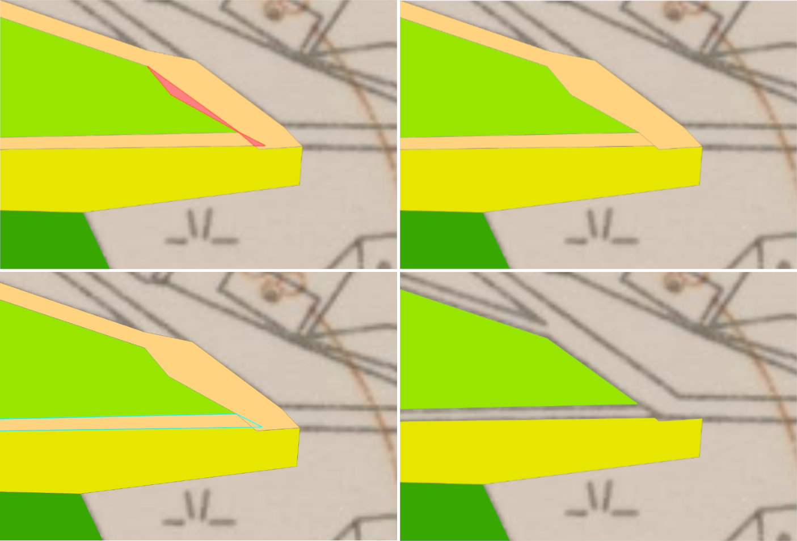

# Georeferencing
Raster data is obtained from many sources, such as satellite images, aerial cameras, and scanned maps. Unlike modern satellite images and aerial cameras that tend to have relatively accurate location information and might need only slight adjustments to line up all your GIS data, scanned maps and historical data usually do not contain any spatial reference information. In these cases you need to use the process of georeferencing. 

Georeferencing is the process of assigning real-world geographic coordinates to a raster image or a scanned map, enabling it to be accurately placed within a spatial reference system. This process involves matching identifiable points on the image with corresponding locations on a reference dataset, such as a satellite image or a vector map. Georeferencing is essential in cartography and GIS, as it allows historical maps, aerial photographs, or other spatial data to be integrated with modern geographic information for analysis, visualization, and decision-making.

<figure markdown>
  { width=600px }
  <figcaption>Georeferencing an old map</figcaption>
</figure>

__Resources:__
{: align=center }

[pro.arcgis.com Overview of georeferencing](https://pro.arcgis.com/en/pro-app/latest/help/data/imagery/overview-of-georeferencing.htm){ .md-button .md-button--primary .server_name .external_link_icon_small target="_blank"}
[pro.arcgis.com Understanding Raster Georeferencing](https://www.esri.com/about/newsroom/arcuser/understanding-raster-georeferencing/){ .md-button .md-button--primary .server_name .external_link_icon_small target="_blank"}
[pro.arcgis.com Georeferencing tools](https://pro.arcgis.com/en/pro-app/latest/help/data/imagery/georeferencing-tools.htm){ .md-button .md-button--primary .server_name .external_link_icon_small target="_blank"}
[learn.arcgis.com/ Georeference historical imagery in ArcGIS Pro](https://learn.arcgis.com/en/projects/georeference-imagery-in-arcgis-pro/){ .md-button .md-button--primary .server_name .external_link_icon_small target="_blank"}
{: .button_array}

# Vectorization, Topology

To analyze raster maps, it is almost always necessary to vectorize them, i.e. convert the map to vector form. There are various options for automating this process, but we will show the simplest method, which is manual vectorization.

### Vectorization

**1.** Vector data editing tools are located in the tab *:material-tab: Edit*{: .outlined_code} at the top of the program. 

**2.** New elements are created by clicking the button *:material-button-cursor: Create*{: .outlined_code} → selecting a drawing of a given subtype in the window *:material-tab: Create Features*{: .outlined_code}.

**3.** Vectorized points are added with the left mouse button. To complete the vectorization of a particular element, either double-click with the left mouse button or select the icon *:material-button-cursor: Finish*{: .outlined_code} in the tools at the bottom of the screen. When vectorizing, you need to think about setting point snapping [_:material-button-cursor: Snapping_{: .outlined_code}](https://pro.arcgis.com/en/pro-app/latest/help/editing/enable-snapping.htm).

<figure markdown>

    <figcaption>Vectorization of a raster map</figcaption>
</figure>

???+ note "&nbsp;Save edit:"
      After making changes in vector data editing, it is necessary to save them by pressing the button *:material-button-cursor: Save*{: .outlined_code} in *:material-tab: Edit*{: .outlined_code}.

### Topology

The image below shows an example of two topological errors found (top left image). The top right image shows a view of the data without topology correction. When compared to the bottom right image, it is clear that the path vectorization has mistakenly overlapped the pasture vectorization. The bottom left image shows the second error, i.e. the mutual overlap of two elements belonging to the same layer.

<figure markdown>

    <figcaption>Example of topological errors</figcaption>
</figure>

## Assignment 03
!!! abstract "Digitalization of old maps"
    **TASK:**

    Digitize a part of the map of old Prague using modern tools. First, georeference the archive material. Then vectorize this map and create a simple map layout.

     
    In technical report answer following questions:
    
    - How has the extent of built-up area changed?
    - Why is digitalization important today?

     
    **DATA SOURCES:**
    
      [:material-map: Plan of Prague (1920–1930)](../assets/Georeferencing/Prague_Plan_1920-1930_detail.jpg){ .md-button .md-button--primary .button_smaller }
      {: .button_array style="justify-content:flex-start;"}

    - Where can I find more old maps?

    [OldMapsOnline](https://www.oldmapsonline.org/){ .md-button .md-button--primary .server_name .external_link_icon_small target="_blank"}
    [David Rumsey Map Collection](https://www.davidrumsey.com/){ .md-button .md-button--primary .server_name .external_link_icon_small target="_blank"}
    {: .button_array}
    
     
    **SUBMISSION FORM:**

    - technical report + 1 map in PDF format (submit by 09/11, send to <a href="mailto:koudeja2@student.cvut.cz">koudeja2@student.cvut.cz</a>)

    [:material-download: Technical report template :material-layers:](../assets/cviceni2/technical_report.doc){ .md-button .md-button--primary .button_smaller }
      {: .button_array style="justify-content:flex-start;"}
    
    

     
    **INSTRUCTIONS:**
    
    **Step 1:** **Georeference the map**

    - Create new project in ArcGIS Pro (save to disk :H).
    - Add the old map to your *Map project* (_add data_).
    - Find the added map (_zoom to layer_).
    - Activate the *Georeference* tool (*Imagery* tab -> _Georeference_).
    - On the *Georeference* tab, click *Add Control Points*. Now try to find at least 4 identical points (control points) on the image *(source)* and the reference map *(target)*. These points should be spread out throughout the image to obtain the best possible registration (For example churches, old bridges, islands, towers...).
    - After collecting all points, on the *Georeference* tab, click *Save* and _Close georeference_.

    **Step 2:** **Vectorization**

    - Create new geodatabase _(Catalog-New-File geodatabase)_.
    - Create new dataset _(Catalog-Geodatabase-New-Dataset)_.
    - Create new feature class *(Catalog-Dataset-New-Feature Class)*. Create one for polygons and one for lines.
    - Create subtypes for a polygon layer _(Attribut table-Table-Add-Subtypes-Create)_. Subtypes are _Water_, _Building_, _Important building_, _Green_, _Street_ and _Others_. Set symbology on subtypes _(Save-Symbology-Unique values)_ and set colors.
    - Vectorize the border of your territory into a line layer.
    - Vectorize your territory into a polygon layer using simple tools.
    - Merge the same subtypes into one element _(Tools-Dissolve)_.
    - Manual topology check _(Edit)_.

    **Step 3:** **Create a layout**

    - Create new Layout (A4 Landscape).
    - Title.
    - Map frame (in scale 1:5,000).
    - Information about scale.
    - Information about author.
    - Legend - add with _(Add legend-Convert to graphics-Ungroup)_ and edit.
    - Try to add some labels to important places.
    - Export *Layout* in PDF Format, DPI 120.

    

<figure markdown>
  { width=800px }
  <figcaption>Template</figcaption>
</figure>