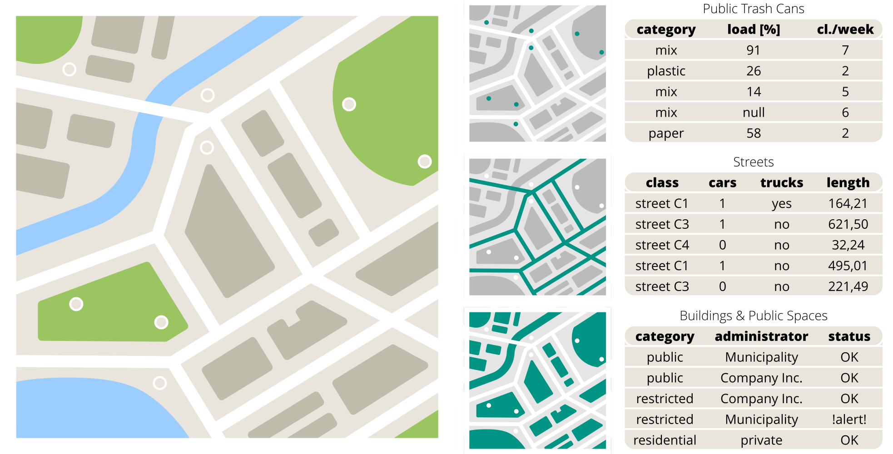
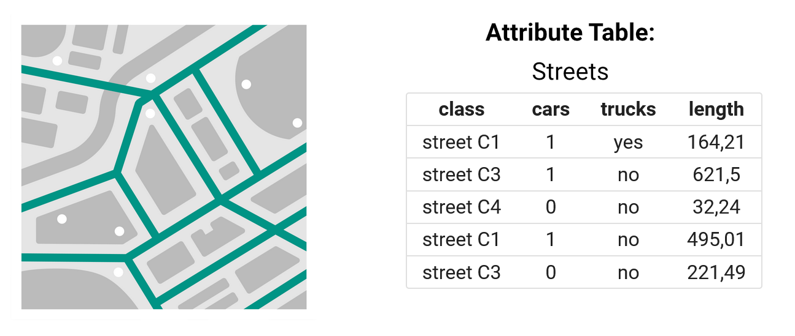
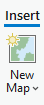
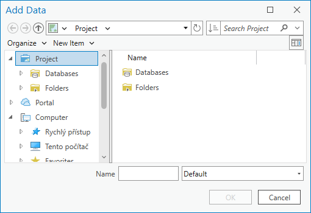
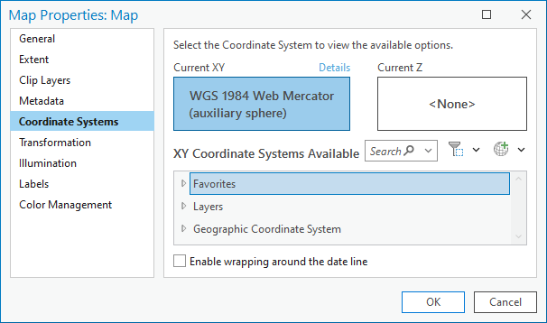

# Introduction to ArcGIS, spatial data, data sources

<!-- 
 -->

## Goals

Introduction to ArcGIS Pro, basic orientation in the user environment, adding data to the map and navigating the map

## Basic terms

### Software we will use
__ArcGIS Pro__, an advanced desktop geographic information system (GIS) developed by __Esri__, will be used during most of the classes. It allows users to __create__, __edit__, __analyze__, and __visualize__ spatial data in various layers, including __raster__ and __vector__ maps, __orthophotos__, __digital elevation models__, and other datasets.  
Users can create and edit __attributes__ and __geometry__ of features, perform advanced __analysis__, create and __publish map layers__, and create __interactive map applications__. The program also includes tools for __visualizing__ data, creating map presentations, and __sharing results__ with other users.

{ .no-filter .off-glb width=200px}
{ .no-filter .off-glb width=200px}
{: align=center}

!!! note-grey "Note"

    Due to its high price, ArcGIS is mainly used in large companies and government agencies. Its open source alternative [QGIS](https://www.qgis.org/){: target="_blank"} is more widespread in smaller companies (will be discussed at the end of the course). This information applies to the environment of the Czech Republic.

### Spatial (GIS) data (vector)
Geographic Information System (GIS) generally uses any data containing __spatial (location) information__. A location can be represented not only by a combination of coordinates (_X + Y_, _latitude + longitude_, etc.), but also by, for example, an _address_ (of arbitrary detail). In addition to the spatial information, any other information is usually added in the form of attributes in the __attribute table__.

<!-- { style="width:80%;"}
{: style="margin-bottom:0px;" align=center }
<figcaption>Schematická ukázka prostorových dat a k nim přiřazených atributových tabulek</figcaption> -->

<!-- 

=== "Body"

    
    
    

    |category|load [%]|cl./week|
    |:------:|:------:|:------:|
    |mix|91|7|
    |plastic|26|2|
    |mix|14|5|
    |mix|14|5|
    |paper|58|2|

=== "Linie"

    
    
    

    |class|cars|trucks|length|
    |:---:|:--:|:----:|:----:|
    |street C1|1|yes|164,21|
    |street C3|1|no|621,5|
    |street C4|0|no|32,24|
    |street C1|1|no|495,01|
    |street C3|0|no|221,49|

=== "Polygony"

    
    
    

    |category|administrator|status|
    |:------:|:-----------:|:----:|
    |public|Municipality|OK|
    |public|Company Inc.|OK|
    |restricted|Company Inc.|OK|
    |restricted|Municipality|!alert!|
    |residential|private|OK|

<figcaption style="clear:both">Schematická ukázka prostorových dat a k nim přiřazených atributových tabulek</figcaption> -->

=== "FULL MAP"

    {.no-filter width="500"}
    {align=center}

    <figcaption>Schematic illustration of spatial data and associated attribute tables</figcaption>

=== "Points"
    
    {.no-filter width="500"}
    {align=center}

    <figcaption>Schematic illustration of spatial data and associated attribute tables</figcaption>

=== "Lines"

    {.no-filter width="500"}
    {align=center}

    <figcaption>Schematic illustration of spatial data and associated attribute tables</figcaption>

=== "Polygons"

    {.no-filter width="500"}
    {align=center}

    <figcaption>Schematic illustration of spatial data and associated attribute tables</figcaption>

__Save spatial data__: Data can be stored in many different ways. There are many different data formats, but to start with, here are some basic ones.

- __Shapefile__: a format from _Esri_ with a mostly open specification. It contains the geometry and properties (attributes) of spatial features, probably the most widely used at present, although it has many disadvantages and is somewhat outdated from today's point of view. One of the characteristics of the format is mandatory division into multiple files (`.shp`, `.shx` and `.dbf`, possibly other optional), which brings difficulties when moving, copying, etc.
- __Geodatabase (GDB)__: the native data structure of the _ArcGIS_ system - the primary data format for data management and editing, it contains a collection of datasets of various types (vector, raster and others) and can also store data integrity (domains, subtypes, etc.) or topology
- __GeoJSON__: an open standard representing vector data and associated attributes, based on the `JSON` format and is therefore user-readable and widely used
- __GML / KML__: similar to GeoJSON - an open standard representing vector data and associated attributes, based on the `XML` format, thus again user-readable
- __GeoPackage (GPKG)__: relatively new format of the _OGC_ standard, supports both vector and raster data, overcomes many limitations of the `Shapefile` format (e.g. it is only 1 file), default format of _QGIS_
- __CSV__: although not a format directly intended for spatial data, it is often used as an exchange format, the file contains only attributes

<!-- Ve výčtu chybí některé __rastrové formáty__, těm se bude výuka věnovat v průběhu pozdějších cvičení. -->

## Contents

### Starting and basic orientation in the program

At launch, the license is verified through the affiliation to the organization (CTU in Prague) - by logging in to the university account. The address (URL) for CTU is _ctuprague.maps.arcgis.com_ - then an automatic redirection to the university login page (in the format _username@cvut.cz_ and password to KOS) takes place.

  
<iframe class="video" src="https://www.youtube.com/embed/8nDVpVmxM-0" title="YouTube video player" frameborder="0" allow="accelerometer; autoplay; clipboard-write; encrypted-media; gyroscope; picture-in-picture; web-share" allowfullscreen></iframe>

  

 <!-- kvuli tomu iframe to nejde bez html (nenasel jsem zpusob) -->

The user interface of the program consists of three basic elements:

|   |   |
| - | - |
| __RIBBON__ | menu of program functions (element identical to other programs, e.g. Microsoft Word), menu changes contextually according to user actions              |
| __PANE__   | panels and function properties, many functions trigger opening their own Panel, through which the function is controlled, e.g. Map Contents, Symbology |
| __VIEW__   | a window with a map (2D) or a scene (3D)                                                                                                               |

  <!-- prazdne radky nelze smazat, Markdown nebere tabulky bez zahlavi, musel jsem vyresit pres css -->

{: .process_container}

<figcaption>All VIEWs and PANEs are dockable – they can be freely moved around the screen and attached to other elements</figcaption>

[Working with Panes in ArcGIS Pro](https://www.youtube.com/watch?v=qNDwVJV_kFk){ .md-button .md-button--primary .button_smaller .external_link_icon target="_blank"}
{: .button_array}

---

__Další zdroje:__
{: align=center }

[pro.arcgis.com Introduction to ArcGIS Pro](https://pro.arcgis.com/en/pro-app/latest/get-started/get-started.htm){ .md-button .md-button--primary .server_name .external_link_icon_small target="_blank"}
[pro.arcgis.com Introducing ArcGIS Pro](https://pro.arcgis.com/en/pro-app/latest/get-started/introducing-arcgis-pro.htm){ .md-button .md-button--primary .server_name .external_link_icon_small target="_blank"}
{: .button_array}

### Adding data to the map

__Creating a map:__ _:material-tab: Insert_{: .outlined} :octicons-arrow-right-24: _:material-button-cursor: New Map_{: .outlined}

{: .process_container}

[Create a map or scene](https://pro.arcgis.com/en/pro-app/latest/help/projects/add-maps-to-a-project.htm#GUID-660CA711-919A-44B0-952A-F2054937077B){ .md-button .md-button--primary .button_smaller .external_link_icon target="_blank"}
{: .button_array}

---

__Adding data to the map__ (lokálně uložených): _:material-tab: Map_{: .outlined} → _:material-button-cursor: Add Data_{: .outlined} → _:material-button-cursor: Data_{: .outlined} → vybrat soubor...

{: .off-glb .process_icon}

{: .off-glb .process_icon}

{: .process_container}

<figcaption>If the file does not appear in the structure, the dialog can be refreshed with the F5 key</figcaption>

[Add data from the Add Data dialog box](https://pro.arcgis.com/en/pro-app/latest/help/mapping/layer-properties/add-layers-to-a-map.htm#ESRI_SECTION2_1C48753A1FD546F385580EF9197DBB8C){ .md-button .md-button--primary .button_smaller .external_link_icon target="_blank"}
{: .button_array}

---

To avoid having to go through the directory structure each time to browse the data, it's a good idea to _join the data directories to the project_.

__Connecting a directory to a project__: in the _Catalog Pane_ ( _:material-tab: View_{: .outlined} → _:material-button-cursor: Catalog Pane_{: .outlined} ) right click on "_Folders_" choose _:material-form-dropdown: Add Folder Connection_{: .outlined} → insert or select a path... → drag & drop the data from the folder into the Map View

{: .off-glb .process_icon}

{: .off-glb .process_icon}

{: .off-glb .process_icon}

{: .process_container}

<figcaption>The selected folder will remain in the Catalog under "Folders". The directory does not have to be local, e.g. the H:\ drive (CTU universal network storage) can be connected this way.</figcaption>

[Connect to a folder](https://pro.arcgis.com/en/pro-app/latest/help/projects/connect-to-a-folder.htm){ .md-button .md-button--primary .button_smaller .external_link_icon target="_blank"}
[The Project Pane](https://pro.arcgis.com/en/pro-app/latest/help/projects/the-project-pane.htm){ .md-button .md-button--primary .button_smaller .external_link_icon target="_blank"}
{: .button_array}

---

...the same can be done with a geodatabase. The geodatabase stores data more efficiently, but you can't store anything in it.

__Connecting the geodatabase to the project__: in the _Catalog Pane_ ( _:material-tab: View_{: .outlined} → _:material-button-cursor: Catalog Pane_{: .outlined} ) right click on "_Databases_" choose _:material-form-dropdown: Add Database_{: .outlined} → insert or select a path to a geodatabase... → drag & drop the data from the folder into the Map View

{: .off-glb .process_icon}

{: .off-glb .process_icon}

{: .off-glb .process_icon}

{: .process_container}

<figcaption>The path to the selected geodatabase remains in the Catalog under "Databases". Again, the path does not have to be local only.</figcaption>

[:material-open-in-new: Connect to a database](https://pro.arcgis.com/en/pro-app/latest/help/projects/connect-to-a-database.htm){ .md-button .md-button--primary .button_smaller target="_blank"}
{: .button_array}

---

__Layer order__: The map content (_Contents Pane_) shows all layers contained in the map. The visibility of each layer can be switched with the checkbox on the left. By changing the order of the layers in the table of contents, the order in which they are rendered in the map is changed.

{: .off-glb .process_icon}

{: .off-glb .process_icon}

{: .process_container}

<figcaption>Contents Pane and an example of reordering and toggling layer visibility</figcaption>

---

__Nastavení (vlastnosti) mapy__: V _Contents Pane_ (Obsah) přes pravé tl. myši na název mapy vybrat _:material-form-dropdown: Properties_{: .outlined}

{: .off-glb .process_icon}

{: .off-glb .process_icon}

{: .process_container}

For start, these items are of interest:

- Tab _:material-label-outline: General_{: .outlined}

    - __Name__
    - __Reference scale__: Fixes the size of the map symbology for the specified scale.
    [:material-open-in-new: Map reference scales](https://pro.arcgis.com/en/pro-app/latest/help/mapping/properties/map-reference-scales.htm){ .md-button .md-button--primary .button_smaller target="_blank" align=right}
    - __Rotation__: Map rotation angle

- Tab _:material-label-outline: Coordinate systems_{: .outlined}

    - Information about the map display coordinate system (separately for position and elevation).
    - __WARNING__, if the coordinate system of the __inserted data__ differs from the __map__ display system, the data is __temporarily__ converted to the __map__ display coordinate system. However, this is an __On-the-fly__ transformation, which is __simplified__ for some coordinate system combinations, and the data may not relate to each other correctly. This situation is __not recommended__ as it can produce __inaccurate results__ for map visualization and data analysis. [__More information__](https://www.esri.com/arcgis-blog/products/arcgis-pro/mapping/projection-on-the-fly-and-geographic-transformations)
    {: style="color:#888;font-size:smaller; line-height:1.1;"}

### Where to get data

__Locally stored files__: access via system path, e.g.:

`C:\Users\Student1\Documents\Geodatabase.gdb\Layer1`
`\\\\data.fsv.cvut.cz\Shares\K155\Public\data\PragueRoads.gdb`
{: align="center" style="font-size:smaller;line-height:1.1; column-gap:50px;" .button_array}

__Data downloadable from the web__: download from any source to a local disk in the form of files, same access as with locally stored files (see above)
{: id="data_online" }

[ArcČR](https://www.arcgis.com/home/item.html?id=16fd9804dac04020938452a77c1ed350){ .md-button .md-button--primary .button_smaller .external_link_icon target="_blank"}
[Geoportal Prague](https://www.geoportalpraha.cz/en){ .md-button .md-button--primary .button_smaller .external_link_icon target="_blank"}
[Geoportal data.Brno](https://datahub.brno.cz/){ .md-button .md-button--primary .button_smaller .external_link_icon target="_blank"}
[open data AOPK](https://gis-aopkcr.opendata.arcgis.com/){ .md-button .md-button--primary .button_smaller .external_link_icon target="_blank"}
[Geoportal ČSÚ](https://geodata.statistika.cz){ .md-button .md-button--primary .button_smaller .external_link_icon target="_blank"}
{: .button_array}

__Connecting streaming data__: _will be part of future exercises_
{: style="color:#888"}

- connection of data services via URL, does not require manual local storage, there are multiple standards for providing these services
{: style="color:#888;font-size:smaller; line-height:1.1;"}

### Map controls

__Explore Tool__: Panning Movement in the map and pop-ups, see Fig.

- __Pop-up__: It is one of the basic elements of the graphical environment of GIS applications. Its (most common) purpose is to provide a quick preview of information about a given feature by clicking on its geometry. However, the form of the window is configurable and the editing tools very variable. By default, the pop-up displays a listing of attributes in table form (Figure).
[Pop-ups](https://pro.arcgis.com/en/pro-app/latest/help/mapping/navigation/pop-ups.htm){ .md-button .md-button--primary .button_smaller .external_link_icon target="_blank"}
- __Map scale__: Indicates the size of the map features compared to their size in reality. In the corner of the map window (fig.) you can select predefined values from the drop-down menu or set any custom value.
[Map scales and scale properties](https://pro.arcgis.com/en/pro-app/latest/help/mapping/navigation/map-scales-and-scale-properties.htm){ .md-button .md-button--primary .button_smaller .external_link_icon target="_blank"}

{: .off-glb .process_icon}

{: .off-glb .process_icon}

{: .off-glb .process_icon}

{: .process_container}

[Navigation](https://pro.arcgis.com/en/pro-app/latest/help/mapping/navigation/navigation-in-arcgis-pro.htm){ .md-button .md-button--primary .button_smaller .external_link_icon target="_blank"}
[Navigate maps and scenes](https://pro.arcgis.com/en/pro-app/latest/get-started/navigate-your-data.htm){ .md-button .md-button--primary .button_smaller .external_link_icon target="_blank"}
{: .button_array}

---

<!--               ↓↓↓ odkazuje na to link ze cviceni 2! -->
__Select Tool__{: #select-tool}: Panning the map and selecting features interactively (using cursor). To deselect (clear selection), see Fig.

- __Add features to selection__: `Shift + click`
- __Remove features from selection__: `Ctrl + click`

{: .off-glb .process_icon}

{: .off-glb .process_icon}

{: .off-glb .process_icon}
{ data-title="Deselect (clear selection)" data-description="" }
{: .process_container}

[Select features interactively](https://pro.arcgis.com/en/pro-app/latest/help/mapping/navigation/select-features-interactively.htm){ .md-button .md-button--primary .button_smaller .external_link_icon target="_blank"}
[Select features for editing](https://pro.arcgis.com/en/pro-app/latest/help/editing/select-features-for-editing.htm){ .md-button .md-button--primary .button_smaller .external_link_icon target="_blank"}
{: .button_array}

---

__Measure Tool__: Interactive measurement of distances, angles, etc.

{: .off-glb .process_icon}

{: .off-glb .process_icon}

{: .process_container}

[Measure](https://pro.arcgis.com/en/pro-app/latest/help/mapping/navigation/measure.htm){ .md-button .md-button--primary .button_smaller .external_link_icon target="_blank"}
{: .button_array}

__Additional resources:__
{: align=center}

[pro.arcgis.com ArcGIS Pro keyboard shortcuts](https://pro.arcgis.com/en/pro-app/latest/get-started/arcgis-pro-keyboard-shortcuts.htm){ .md-button .md-button--primary .server_name .external_link_icon_small target="_blank"}
[:octicons-file-16: PDF ArcGIS Pro shortcuts](https://www.esri.com/content/dam/esrisites/en-us/media/pdf/g526942-arcgis-pro-kybrd-shrtct-FINAL.pdf){ .md-button .md-button--primary .server_name target="_blank"}
{: .button_array}

### Attribute table

The attribute table is a __supplement to the spatial data__ – it enriches each element (geometry) with __additional information__ (called attributes). This information is crucial for GIS work, because geometry alone (without attributes) does not give us much information. The attribute table is therefore part of every (vector) layer.

The table contains columns - called fields, and rows - called records. Each element thus contains the values of all attributes - see the example below.

<!-- 
{: .process_container}

<figcaption>Atributová tabulka</figcaption>

Otevřít atributovou tabulku

Vybrat záznamy

Zjistit počet prvků / počet vybraných prvků

Přidat pole / editovat pole -->

[Tables](https://pro.arcgis.com/en/pro-app/latest/help/data/tables/tables-in-arcgis-pro.htm){ .md-button .md-button--primary .button_smaller .external_link_icon target="_blank"}
[Open tabular data](https://pro.arcgis.com/en/pro-app/latest/help/data/tables/open-tabular-data.htm){ .md-button .md-button--primary .button_smaller .external_link_icon target="_blank"}
[Interact with a table](https://pro.arcgis.com/en/pro-app/latest/help/data/tables/interact-with-a-table.htm){ .md-button .md-button--primary .button_smaller .external_link_icon target="_blank"}
[Select records in a table interactively](https://pro.arcgis.com/en/pro-app/latest/help/data/tables/select-records-in-a-table-interactively.htm){ .md-button .md-button--primary .button_smaller .external_link_icon target="_blank"}
[Edit an active table](https://pro.arcgis.com/en/pro-app/latest/help/data/tables/edit-an-active-table.htm){ .md-button .md-button--primary .button_smaller .external_link_icon target="_blank"}
{: .button_array}

<!--

## Úlohy k procvičení

!!! task-fg-color "Úloha"

    - Zadání
        - Zobrazte v mapovém okně zadané vrstvy z geoportálu, mapa musí mít __zadané měřítko__, __natočení__ a __projekci__ (souř. systém), vrstvy musí mít __správné pořadí__ a __výběrem označené zadané prvky__. Dále nad mapou zobrazte __vyskakovací okno__ (pop-up) zadaného prvku a správně určete __vzdálenost mezi zadanými prvky__.
        - Použijte data z geoportálu &nbsp;[:material-open-in-new: Geoportal data.Brno](https://data.brno.cz/explore){ .md-button .md-button--primary .button_smaller target="_blank"}&nbsp; – konkrétně datovou vrstvu obsahující __`zastávky MHD`__ a __`trasy linek MHD`__, výstupní formát libovolný (doporučujeme __`Shapefile`__ nebo __`Souborová geodatabáze`__)

    - Výstupy
        - Screenshot mapy splňující všechny výše popsané vlastnosti
        - Screenshot pop-upu nad zadaným prvkem
        - Napsat vzdálenost mezi konkrétními dvěma prvky

    - Individuální zadání
        - DODĚLAT -->

           

<!-- 
                  

Test nadpisů:

# Nadpis 1

## Nadpis 2

### Nadpis 3

#### Nadpis 4

##### Nadpis 5

###### Nadpis 6

...další text...

 -->

