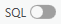

# Vector data, attribute queries, spatial queries

<!-- ## Cíl cvičení -->

## Basic terms

### Vector and raster spatial data

  

    <svg xmlns="http://www.w3.org/2000/svg" viewBox="0 0 24 24"><path d="M2 3v6h2.95l2 6H6v6h6v-4.59L17.41 11H22V5h-6v4.57L10.59 15H9.06l-2-6H8V3M4 5h2v2H4m14 0h2v2h-2M8 17h2v2H8Z"></path></svg>&nbsp;
    <strong>Vector data</strong>
    

    
Formed by <strong>vertices</strong> and <strong>paths</strong> - these are determined by actual coordinates.

    
The detail is determined by the <strong>detail of the vertex coordinates</strong>.

    
Suitable for <strong>discretely distributed data</strong> (e.g. point locations, land cover categories)

    
Possible <strong>topology problems</strong> (gaps and overlaps)

  

  

    <svg xmlns="http://www.w3.org/2000/svg" viewBox="0 0 24 24"><path d="M10 4v4h4V4h-4m6 0v4h4V4h-4m0 6v4h4v-4h-4m0 6v4h4v-4h-4m-2 4v-4h-4v4h4m-6 0v-4H4v4h4m0-6v-4H4v4h4m0-6V4H4v4h4m2 6h4v-4h-4v4M4 2h16a2 2 0 0 1 2 2v16a2 2 0 0 1-2 2H4c-1.08 0-2-.9-2-2V4a2 2 0 0 1 2-2Z"></path></svg>&nbsp;
    <strong>Raster data</strong>
    covered by following practicals
    

    
Formed by a regular <strong>grid of pixels</strong> – these are determined by pixel coordinates (row/column)

    
Detail is determined by <strong>pixel size</strong> (in meters)

    
Suitable for phenomena changing both <strong>continuously</strong> (e.g. terrain model, air pollution) and <strong>discretely</strong>, as well as <strong>image data</strong> (e.g. satellite)

  

<!-- ## Použité datové podklady -->

## Contents

### Attribute queries

Attribute Query is a method of selecting/filtering elements based on __attribute values__. It complements the [interactive feature selection](/cviceni/cviceni1/#select-tool) method from practical 1. The basis is a selection rule - called __Expression__. ArcGIS Pro allows you to build expressions interactively using a dialog, but to use the full potential of expressions, it is recommended to use SQL code.
  

__Attribute query__ (over map data): _:material-tab: Map_{: .outlined} → _:material-button-cursor: Select By Attributes_{: .outlined} → fill in the dialog...
[Select features using attributes](https://pro.arcgis.com/en/pro-app/latest/help/mapping/navigation/select-features-using-attributes.htm){ .md-button .md-button--primary .button_smaller .external_link_icon target="_blank"}

{: .off-glb .process_icon}

{: .off-glb .process_icon}

{: .process_container}

<figcaption markdown>The `Input Rows` field is automatically prepopulated with the layer selected in the map content</figcaption>

Using the {: .off-glb style="vertical-align: -20%;margin:0px 5px;"} you can change the notation between the interactive dialog entry and the SQL expression.

[Introduction to query expressions](https://pro.arcgis.com/en/pro-app/latest/help/mapping/navigation/write-a-query-in-the-query-builder.htm){ .md-button .md-button--primary .button_smaller .external_link_icon target="\_blank"}
[Construct and modify queries](https://pro.arcgis.com/en/pro-app/latest/help/mapping/navigation/construct-and-modify-queries.htm){ .md-button .md-button--primary .button_smaller .external_link_icon target="\_blank"}
{: .button_array}

  
Example to try

testing attribute queries on real data

  <iframe style="filter:none !important;margin-top:.6rem;" width="100%" height="500" frameborder="0" allowfullscreen src="https://geo.fsv.cvut.cz/data/hoffmann/appqueryGISE/"></iframe>
  

  
Layer attributes scheme:

  
  

  <table>
    <tr>
      <th>attribute</th>
      <th>data type</th>
      <th>description</th>
    </tr>
    <tr>
      <td>FEATURECLA</td>
      <td><code>String</code></td>
      <td>Populated places classification</td>
    </tr>
    <tr>
      <td>NAME</td>
      <td><code>String</code></td>
      <td>Name of the populated place</td>
    </tr>
    <tr>
      <td>WORLDCITY</td>
      <td><code>Integer</code></td>
      <td>Whether the place is classified as a World city,  <code>0=no</code>, <code>1=yes</code></td>
    </tr>
    <tr>
      <td>MEGACITY</td>
      <td><code>Integer</code></td>
      <td>Whether the place is classified as a Mega city,  <code>0=no</code>, <code>1=yes</code></td>
    </tr>
    <tr>
      <td>SOV0NAME</td>
      <td><code>String</code></td>
      <td>Name of the sovereign country</td>
    </tr>
    <tr>
      <td>ADM0NAME</td>
      <td><code>String</code></td>
      <td>Name of the admin country</td>
    </tr>
    <tr>
      <td>ADM1NAME	</td>
      <td><code>String</code></td>
      <td>Name of the First-level administrative devision in a country</td>
    </tr>
    <tr>
      <td>LATITUDE</td>
      <td><code>Double</code></td>
      <td>Latitude</td>
    </tr>
    <tr>
      <td>LONGITUDE</td>
      <td><code>Double</code></td>
      <td>Longitude</td>
    </tr>
    <tr>
      <td>POP_MAX</td>
      <td><code>Double</code></td>
      <td>Estimate of inhabitants of the place <b>with</b> urban agglomeration</td>
    </tr>
    <tr>
      <td>POP_MIN</td>
      <td><code>Double</code></td>
      <td>Estimate of inhabitants of the place <b>without</b> urban agglomeration</td>
    </tr>
    <tr>
      <td>TIMEZONE</td>
      <td><code>String</code></td>
      <td>Name of the timezone</td>
    </tr>
  </table>
  

### Spatial queries

Spatial Query is a method of selecting/filtering elements of one layer based on their relative position with elements of another layer. The function uses as input the __`layer of selected elements`__, the __`layer for overlay analysis`__ a the __`relationship for overlay analysis`__.

<!-- { .off-glb .no-filter }
{ .off-glb .no-filter }
{: .process_container style="flex-wrap:wrap; row-gap: 10px;"} -->

{ .no-filter }
{ .no-filter }
{: .process_container}

 <!-- trik: vlastnosti tabulky pro vsechny podrizene -->

=== "Select POINTS..."

    === "...using POINTS"

        { style="filter:none !important;" }
        {: align=center}

        <table style="width:unset;">
            <tr><td>Intersect</td><td>A</td></tr>
            <tr><td>Intersect (DBMS)</td><td>A</td></tr>
            <tr><td>Contains</td><td>A</td></tr>
            <tr><td>Contains Clementini</td><td>A</td></tr>
            <tr><td>Within</td><td>A</td></tr>
            <tr><td>Within Clementini</td><td>A</td></tr>
            <tr><td>Are identical to</td><td>A</td></tr>
            <tr><td>Have their center in</td><td>A</td></tr>
        </table>

    === "...using LINES"

        { style="filter:none !important;" }
        {: align=center}

        <table id="small_table_padding" style="width:unset;">
            <tr><td>Intersect</td><td>A, C</td></tr>
            <tr><td>Intersect (DBMS)</td><td>A, C</td></tr>
            <tr><td>Within</td><td>A, C</td></tr>
            <tr><td>Completely within</td><td>A</td></tr>
            <tr><td>Within Clementini</td><td>A</td></tr>
            <tr><td>Have their center in</td><td>A, C</td></tr>
            <tr><td>Boundary touches</td><td>C</td></tr>
        </table>

    === "...using POLYGONS"

        { style="filter:none !important;" }
        {: align=center}

        <table id="small_table_padding" style="width:unset;">
          <tr><td>Intersect</td><td>A, C</td></tr>
          <tr><td>Intersect (DBMS)</td><td>A, C</td></tr>
          <tr><td>Within</td><td>A, C</td></tr>
          <tr><td>Completely within</td><td>A</td></tr>
          <tr><td>Within Clementini</td><td>A</td></tr>
          <tr><td>Have their center in</td><td>A, C</td></tr>
          <tr><td>Boundary touches</td><td>C</td></tr>
        </table>

=== "Select LINES..."

    === "...using POINTS"

        { style="filter:none !important;" }
        {: align=center}

        <table id="small_table_padding" style="width:unset;">
          <tr><td>Intersect</td><td>A, C, D</td></tr>
          <tr><td>Intersect (DBMS)</td><td>A, C, D</td></tr>
          <tr><td>Contains</td><td>A, C, D</td></tr>
          <tr><td>Completely contains</td><td>A, D</td></tr>
          <tr><td>Contains Clementini</td><td>A, D</td></tr>
          <tr><td>Have their center in</td><td>D</td></tr>
          <tr><td>Boundary touches</td><td>C</td></tr>
        </table>

    === "...using LINES"

        { style="filter:none !important;" }
        {: align=center}

        <table id="small_table_padding" style="width:unset;">
          <tr><td>Intersect</td><td>A, C, D, E, F, G, H, I, J</td></tr>
          <tr><td>Intersect (DBMS)</td><td>A, C, D, E, F, G, H, I, J</td></tr>
          <tr><td>Contains</td><td>G, H</td></tr>
          <tr><td>Completely contains</td><td>G</td></tr>
          <tr><td>Contains Clementini</td><td>G, H</td></tr>
          <tr><td>Within</td><td>F, H</td></tr>
          <tr><td>Completely within</td><td>F</td></tr>
          <tr><td>Within Clementini</td><td>F, H</td></tr>
          <tr><td>Are identical to</td><td>H</td></tr>
          <tr><td>Boundary touches</td><td>C, E</td></tr>
          <tr><td>Share a line segment with</td><td>F, G, H, I, J</td></tr>
        </table>

    === "...using POLYGONS"

        { style="filter:none !important;" }
        {: align=center}

        <table id="small_table_padding" style="width:unset;">
          <tr><td>Intersect</td><td>A, C, D, E, F, G, H, I, J, K, L, M, N, O</td></tr>
          <tr><td>Intersect (DBMS)</td><td>A, C, D, E, F, G, H, I, J, K, L, M, N, O</td></tr>
          <tr><td>Within</td><td>A, D, G, H, I, O</td></tr>
          <tr><td>Completely within</td><td>A</td></tr>
          <tr><td>Within Clementini</td><td>A, D, G, H, I</td></tr>
          <tr><td>Boundary touches</td><td>F, G, H, I, K, L, M, N, O</td></tr>
          <tr><td>Share a line segment with</td><td>G, I, J, K, M, O</td></tr>
          <tr><td>Crossed by the outline of</td><td>C, E, H, L, N</td></tr>
          <tr><td>Have their center in</td><td>A, C, D, E, G, H, I, J, O</td></tr>
        </table>

=== "Select POLYGONS..."

    === "...using POINTS"

        { style="filter:none !important;" }
        {: align=center}

        <table id="small_table_padding" style="width:unset;">
          <tr><td>Intersect</td><td>A, B</td></tr>
          <tr><td>Intersect (DBMS)</td><td>A, B</td></tr>
          <tr><td>Contains</td><td>A, B</td></tr>
          <tr><td>Completely contains</td><td>A</td></tr>
          <tr><td>Contains Clementini</td><td>A</td></tr>
          <tr><td>Have their center in</td><td>A, D</td></tr>
          <tr><td>Boundary touches</td><td>B</td></tr>
        </table>

    === "...using LINES"

        { style="filter:none !important;" }
        {: align=center}

        <table id="small_table_padding" style="width:unset;">
          <tr><td>Intersect</td><td>A, C, D, E, F, G, H, I, J, K, L, M, N, O</td></tr>
          <tr><td>Intersect (DBMS)</td><td>A, C, D, E, F, G, H, I, J, K, L, M, N, O</td></tr>
          <tr><td>Contains</td><td>A, D, G, H, I, O</td></tr>
          <tr><td>Completely contains</td><td>A</td></tr>
          <tr><td>Contains Clementini</td><td>A, D, G, H, I</td></tr>
          <tr><td>Boundary touches</td><td>F, G, H, I, K, L, M, N, O</td></tr>
          <tr><td>Share a line segment with</td><td>G, I, J, K, M, O</td></tr>
          <tr><td>Crossed by the outline of</td><td>C, E, H, L, N</td></tr>
          <tr><td>Have their center in</td><td>E, I, L</td></tr>
        </table>

    === "...using POLYGONS"

        { style="filter:none !important;" }
        {: align=center}

        <table id="small_table_padding" style="width:unset;">
          <tr><td>Intersect</td><td>A, C, D, E, F, G, H, I, J, K, M</td></tr>
          <tr><td>Intersect (DBMS)</td><td>A, C, D, E, F, G, H, I, J, K, M</td></tr>
          <tr><td>Contains</td><td>C, E, H, M</td></tr>
          <tr><td>Completely contains</td><td>C</td></tr>
          <tr><td>Contains Clementini</td><td>C, E, H, M</td></tr>
          <tr><td>Within</td><td>F, G, H, M</td></tr>
          <tr><td>Completely within</td><td>F</td></tr>
          <tr><td>Within Clementini</td><td>F, G, H, M</td></tr>
          <tr><td>Are identical to</td><td>H, M</td></tr>
          <tr><td>Boundary touches</td><td>D, E, G, H, I, J, M</td></tr>
          <tr><td>Share a line segment with</td><td>D, H, I, M</td></tr>
          <tr><td>Crossed by the outline of</td><td>A, E, G, J, K</td></tr>
          <tr><td>Have their center in</td><td>C, E, F, G, H, K, L</td></tr>
        </table>
        

<!-- <figcaption markdown>zdroj: [Select By Location graphic examples](https://pro.arcgis.com/en/pro-app/latest/tool-reference/data-management/select-by-location-graphical-examples.htm)</figcaption> -->

[:material-open-in-new: Select features by location](https://pro.arcgis.com/en/pro-app/latest/help/mapping/navigation/select-features-by-location.htm){ .md-button .md-button--primary .button_smaller target="\_blank"}
[:material-open-in-new: Select Layer By Location (Data Management)](https://pro.arcgis.com/en/pro-app/latest/tool-reference/data-management/select-layer-by-location.htm){ .md-button .md-button--primary .button_smaller target="\_blank"}
[:material-open-in-new: Select By Location graphic examples](https://pro.arcgis.com/en/pro-app/latest/tool-reference/data-management/select-by-location-graphical-examples.htm){ .md-button .md-button--primary .button_smaller target="\_blank"}
{: align=center style="display:flex; justify-content:center; align-items:center; column-gap:20px; row-gap:10px; flex-wrap:wrap;"}

      

<!-- ## Zadání domácího úkolu k semestrální práci -->

