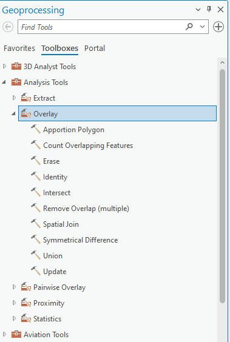
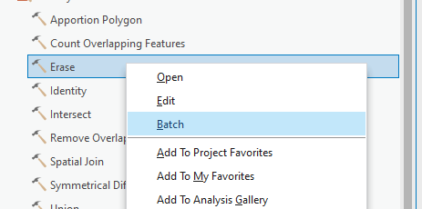
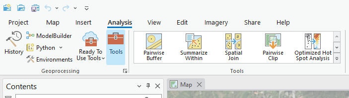
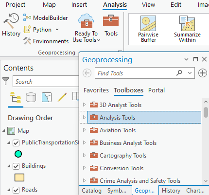
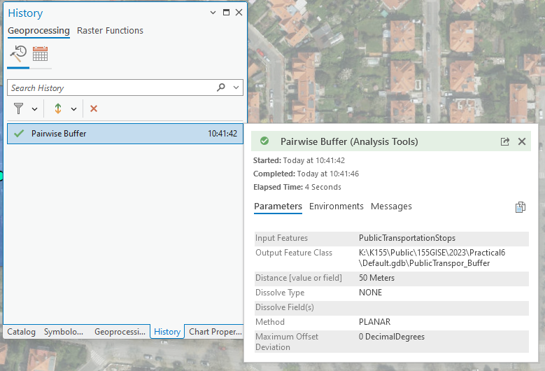

# Geoprocessing tools

## Basic terms

Geoprocessing in ArcGIS is the engine that drives spatial analysis, offering a suite of tools to manipulate and analyze geographic data. It allows us to perform tasks ranging from basic operations like buffering and overlaying maps to advanced analyses such as terrain modeling. Geoprocessing not only streamlines workflows and automates tasks but also reveals valuable insights by uncovering spatial patterns and relationships.

### Toolboxes

In ArcGIS, a toolbox is a container for organizing and storing geoprocessing tools. It's a way to organize and manage various geoprocessing tools and models in a structured manner. Toolboxes can be thought of as folders that hold a collection of related tools, scripts, and models, making it easier to locate and use them efficiently.

{ .no-filter .off-glb }
{: align=center}

### Batch Processing

Batch processing in ArcGIS is a time-saving technique where the same geoprocessing operation is applied to multiple datasets simultaneously.

{ .no-filter .off-glb }
{: align=center}

### ModelBuilder

ModelBuilder is a visual programming environment that allows users to create, edit, and manage workflows by stringing together a sequence of geoprocessing tools and operations. It provides a graphical interface for designing and automating complex geospatial analyses, making it easier for users to conceptualize, build, and share spatial models.

{ .no-filter .off-glb }
{: align=center}

### List of basic geoprocessing tools

- [**buffer**](https://pro.arcgis.com/en/pro-app/latest/tool-reference/analysis/buffer.htm)
- [**clip**](https://pro.arcgis.com/en/pro-app/latest/tool-reference/analysis/clip.htm)
- [**select**](https://pro.arcgis.com/en/pro-app/latest/tool-reference/analysis/select.htm)
- [**intersect**](https://pro.arcgis.com/en/pro-app/latest/tool-reference/analysis/intersect.htm)
- [**spatial join**](https://pro.arcgis.com/en/pro-app/latest/tool-reference/analysis/spatial-join.htm)
- [**erase**](https://pro.arcgis.com/en/pro-app/latest/tool-reference/analysis/erase.htm)
- [**union**](https://pro.arcgis.com/en/pro-app/latest/tool-reference/analysis/union.htm)
- [**remove overlap**](https://pro.arcgis.com/en/pro-app/latest/tool-reference/analysis/remove-overlap-multiple.htm)
- [**symmetrical difference**](https://pro.arcgis.com/en/pro-app/latest/tool-reference/analysis/symmetrical-difference.htm)
- [**count overlapping features**](https://pro.arcgis.com/en/pro-app/latest/tool-reference/analysis/count-overlapping-features.htm)

## Workflow

### Where to find it

Geoprocessing is the engine of ArcGIS Pro which means that the geoprocessing tools are integrated in various locations throughout the software.

#### Analysis Tools Gallery

Analysis Tools gallery higlights the most used spatial analysis tools.

{ .no-filter .off-glb }
{: align=center}

#### Geoprocessing pane

Geoprocessing pane opens from the Tools button in Geoprocessing Group inside Analysis tab. To locate geoprocessing tools, simply type a search phrase into the search bar at the top of the Geoprocessing pane. Whether you know the tool's name or are describing the operation you need, this search feature helps you find the right geoprocessing tool efficiently.

{ .no-filter .off-glb }
{: align=center}

### Run the geoprocessing tool

After choosing a specific geoprocessing tool, a configuration interface opens. After filling the required parameters indicated by the red asterix, the Run button is activated. When a tool is run, a progress bar is displayed in the Geoprocessing pane where you can view tool progress and messages. After finishing a specific symbol indicating Success, Warning or Error appears. When the tool is finished running, the output layer is added to the active map.

{ .no-filter .off-glb }
{: align=center}

### Geoprocessing history

Every time you run a geoprocessing tool, a new entry is added in the History pane under the Geoprocessing tab.
By hovering over the tool entry, information about the tool's execution and messages appears. You can also double-click the entry to reopen the tool with the same parameter values.

{ .no-filter .off-glb }
{: align=center}

## Task

### Objective

Identify a suitable location for a new bus stop in Prague, considering specific criteria to optimize accessibility and convenience.

### Data

- Public transport stops
- Roads
- Buildings

_Data source: [Geoportal Praha](https://geoportalpraha.cz/ "Prague geographic data in one place")._

### Requirements

#### Proximity to Big Roads:

- Analyze the road data to identify major roads.
- Use a geoprocessing tool make a buffer of **5 meters** to make sure the bus can pass through the street.

#### Distance from Other Public Transport Stops:

- Analyze the public transport stops data.
- Ensure the selected location for the new bus stop is at least **300 meters** away from any existing public transport stop.

#### Proximity to Buildings:

- Analyze the buildings data.
- Ensure the selected location has at least **50 buildings** within a **100-meter radius**.

### _Bonus_

Create a ModelBuilder that allows you to run the same analysis with different parameters and evaluate their impact.
