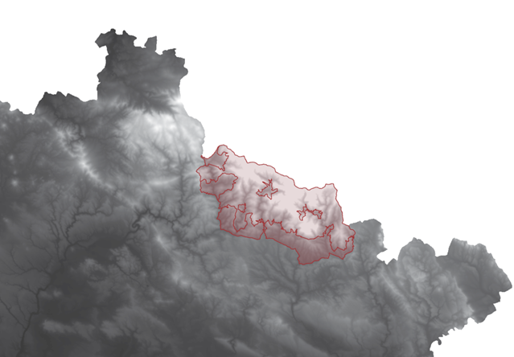
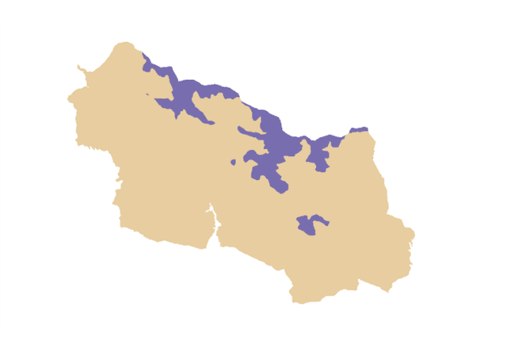

# Geoprocessing tools for raster data

## Assignment: Indicate areas of avalanche risk
The aim of this training is to provide experience with real-world GIS tasks. Your knowledge and skills acquired from previous lessons will be used when processing the task.
Your mission will be to evaluate which slopes are prone to avalanches and possible threats to the surroundings. You are going to monitor the situation within one selected Czech national parc.
An essential part, without which the work cannot be done, is the acquisition of data from publicly available sources and the subsequent modification of the data in the GIS environment so that you can perform future analysis with them. At the beginning, you will receive a package of input data containing all necessary. Based on the DEM, it will be your goal to process and evaluate which slopes are prone to avalanche danger. To evaluate an avalanche slope, you need to know slope inclination, elevation, wind speed, and land cover.

Criteria indicating a dangerous hillside with avalanche hazard potencial:

- Area in the highest third of assigned national parc

- Slope > 30°

- CLC land cover code = 2.X.X or 3.X.X (except for 3.1.1, 3.1.2, and 3.1.3)

- Peaks in windier half of assigned national parc

Input [Data Package](../assets/cviceni7/AvalancheRisk.gdb.zip) includes:

- Digital elevation model (DEM)

- Wind speed measurement

- Corine Land Cover (CLC)

- Czechia protected land areas

!!! note-grey "Note"

    “A DEM is a raster representation of a continuous surface, usually referencing the surface of the earth. The accuracy of this data is determined primarily by the resolution (the distance between sample points). Other factors affecting accuracy are data type (integer or floating point) and the actual sampling of the surface when creating the original DEM.” (pro.arcgis.com)

!!! note-grey "Note"

    “The CORINE Land Cover is provided for 1990, 2000, 2006, 2012, and 2018. This vector-based dataset includes 44 land cover and land use classes. The time-series also includes a land change layer, highlighting changes in land cover and land-use.” (land.copernicus.eu)

__Resources:__
{: align=center }

[pro.arcgis.com Exploring Digital Elevation Models](https://pro.arcgis.com/en/pro-app/latest/tool-reference/spatial-analyst/exploring-digital-elevation-models.htm){ .md-button .md-button--primary .server_name .external_link_icon_small target="_blank"}
[land.copernicus.eu CORINE Land Cover](https://land.copernicus.eu/pan-european/corine-land-cover){ .md-button .md-button--primary .server_name .external_link_icon_small target="_blank"}
[land.copernicus.eu CORINE Land Cover Guide](https://land.copernicus.eu/user-corner/technical-library/corine-land-cover-nomenclature-guidelines/html){ .md-button .md-button--primary .server_name .external_link_icon_small target="_blank"}
{: .button_array}

**1.** Exploring Input Data

First of all, it’s always essential to start with exploring input data, understand the data types or browse the attribute tables for instance.

- *Czech DEM* is a raster which stores values of height above sea level.

- *Czech protected land areas* is a polygon feature layer containing polygons of national parks, etc.

- *Wind speed measurement* is a point feature layer of measurement units in Czechia with average measured wind speed.

- *Corine Land Cover* is a classified raster including many land cover and land use classes.

**2.** Get Your Input Data Ready

- Set Křovák projection (EPSG: 5514)

- Use definition query to display assigned Czech national parc. Picture below is displaying Krkonoše national parc using definition query; DEM in the background.

{ .no-filter .off-glb}
{: align=center}
 
- Use Extract by Mask tool to clip raster by assigned national parc polygon.

**3.** Raster Analysis

In the following step, a set of spatial analysis tools together with subsequent reclassification will be processed to calculate and classify elevation and slope (steepness). Later on, you will deal with reclassification of Corine Land Cover raster and finally, suitable interpolation method will be used to help you process wind speed data.

- Use Slope function to calculate the steepness. Use extracted raster by your national parc as an input raster. The output should be similar to following picture.

{ .no-filter .off-glb}
{: align=center}
 
- Use Reclassify tool to change the values in slope raster. Basically, you’re interested in two categories: 0°–30° and 30°–90° so you can define new values: 0 and 1. Zero stands for “doesn’t meet the criteria”.

{ .no-filter .off-glb}
{: align=center}
 
- Similarly you need to reclassify your extracted DEM to decide, which values are within the highest third of national parc. In Krkonoše national parc, the highest third is indicated by violet color (see the picture below).

{ .no-filter .off-glb}
{: align=center}
 
- By this time, you should have two reclassified raster layers (elevation and slope). Now it’s time to do the same with CORINE Land Cover data. Such raster reclassification might look a little bit sophisticated since you have to discover and use the land cover codes in the attribute table. The criteria in the assignment are clear enough so it is going to be an easy job anyway.

- If you were successful to reclassify three raster layers, you can move to wind speed feature layer. You’ve processed only raster data so far. Since you need to use raster calculator in the very ending, your final outputs have to be raster layers, so it is necessary to “transform” a point layer using some math into a raster (continuous surface).

!!! note-grey "Note"

    “Interpolation predicts values for cells in a raster from a limited number of sample data points. It can be used to predict unknown values for any geographic point data, such as elevation, rainfall, chemical concentrations, and noise levels.” (pro.arcgis.com)

__Resources:__
{: align=center }

[pro.arcgis.com Understanding interpolation analysis](https://pro.arcgis.com/en/pro-app/latest/tool-reference/spatial-analyst/understanding-interpolation-analysis.htm){ .md-button .md-button--primary .server_name .external_link_icon_small target="_blank"}
[pro.arcgis.com An introduction to interpolation methods](https://pro.arcgis.com/en/pro-app/latest/help/analysis/geostatistical-analyst/an-introduction-to-interpolation-methods.htm){ .md-button .md-button--primary .server_name .external_link_icon_small target="_blank"}
[pro.arcgis.com Comparing interpolation methods](https://pro.arcgis.com/en/pro-app/latest/tool-reference/spatial-analyst/comparing-interpolation-methods.htm){ .md-button .md-button--primary .server_name .external_link_icon_small target="_blank"}
{: .button_array}

- Using some of the links above, you can compare interpolation methods and choose the best one (or at least suitable) for point data. For this purpose, Inverse distance weighing (IDW) looks promising. Fill speed attribute as a Z field value and don’t forget to define an Output cell size (should be consistent for all your raster layers).

- The output should be calculated for entire Czech Republic and clipped by national parc polygon subsequently (if you first clip than interpolate, your result won’t be accurate)

- Afterwards, the last reclassification is ahead: you have to detect a windier part of assigned national parc

**4.** Combine the criteria and find out the result!

Now is time for the best part of solution: combining the reclassified raster layers and finding out risky areas. All you need is to use Raster Calclulator and compile an appropriate algebraic expression. Your raster layers include only values of 0 and 1. As it’s mentioned above, zero is against the criteria. The final question is, how to construct four values as an algebra expression so the resulting raster layer would consist of values 0 and 1 again and zero would stand for “safe” slopes? Zero will represent for example an area in windier part & lower half of national parc or area in the highest third of national parc & having land cover code 1.2.1.

{ .no-filter .off-glb}
{: align=center}

Avalanche risk in national parc Krkonoše is red-colored in the picture below. It is possible to make the final raster semi-transparent and set Czech orthophoto as a background map to better illustrate the result for instance.

{ .no-filter .off-glb}
{: align=center}

Another approach could be represented by symbolizing different levels of avalanche risk, which can be reached if you change the expression in raster calculator. Instead of multiplying the values of four raster layers, you can simply sum them up. Output will consist of 5 different values: 0, 1, 2, 3, or 4. Change raster symbology afterwards to indicate increasing avalanche risk according to the that values.
