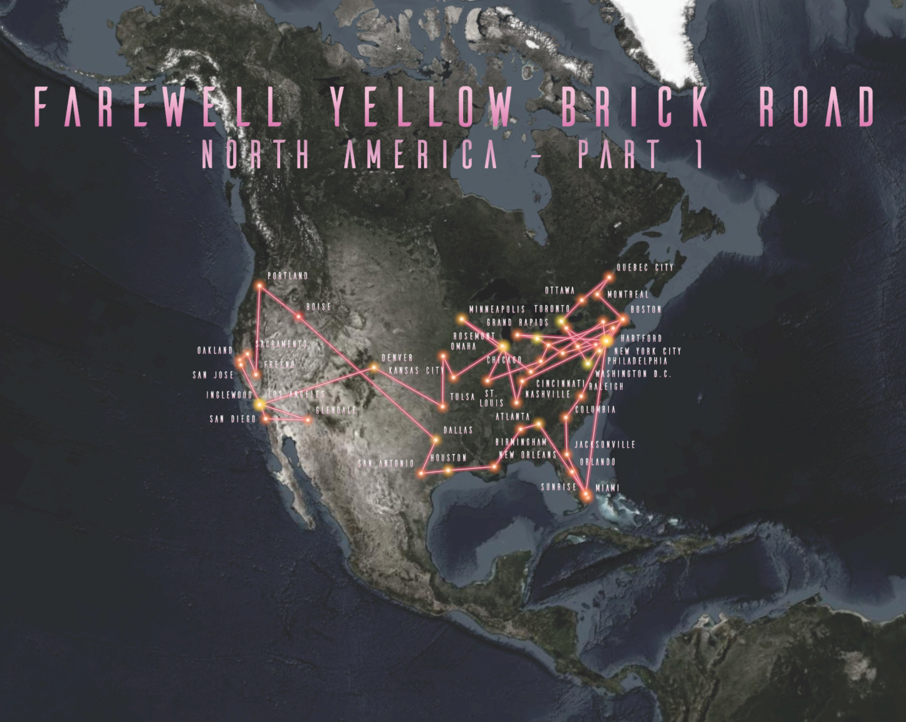

# Geocoding
Finding places on a map is an integral part of a GIS. *Geocoding* is the process of transforming a description of a location (such as a pair of coordinates, an address, or a name of a place) to a location on the earth's surface. You can geocode by providing one location description at a time to zoom to a location on a map or convert an entire table that can be used for spatial analysis. 

__Resources:__
{: align=center }

[pro.arcgis.com Geocoding in ArcGIS Pro](https://pro.arcgis.com/en/pro-app/latest/help/data/geocoding/convert-a-table-to-locations-on-the-map.htm){ .md-button .md-button--primary .server_name .external_link_icon_small target="_blank"}
[pro.arcgis.com Rematch geocoded locations](https://pro.arcgis.com/en/pro-app/latest/help/data/geocoding/rematch-locations-converted-from-a-table.htm){ .md-button .md-button--primary .server_name .external_link_icon_small target="_blank"}
{: .button_array}

!!! note-grey "Geoparsing"

    Geoparsing is a sofisticated task consisting of two main steps. First one is identifying place names in text (toponym recognition, or named entity recognition for place names). This is the task of identifying place names in text, such as “Paris” or “Aleppo”.
    Second one is resolving place names to their geographic coordinates or entry in a gazetteer of place names (toponym resolution). This main difficulty in this step is handling ambiguous place names: “Aleppo” could refer to the city in Syria, the governorate in Syria, or the township in Pennsylvania.

## Assignment: Geocode your favorite artist tour

Your task is to create a visualisation called *My favorite artist tour*. This consists of downloading, editing, geocoding, and visualizing the data using GIS.

*GIS Workflow:*

**1.** Pick one of your favorite artist and look for one of the artist's tour in Wikipedia. If you are not into music, you can use [*Farewell Yellow Brick Road*](https://en.wikipedia.org/wiki/Farewell_Yellow_Brick_Road) tour by Elton John.

**2.** Import data to MS Excel. Not manually, use import data from web, enter the URL and let Excel to read the table automatically.

**3.** If there are too many dates, you can limit the tour extent to one continent for example, it is not necessary to use all the data (in the case of mentioned tour, you can use only upper rows for North America). Save the table as XLSX.

**4.** Import table the table to ArcGIS Pro.

**5.** Right-click the table and select *Geocode Addresses* and the geocoding guide is loaded, which is very instructive. Go through the geocoding (do not forget to estimate the credits and run the operation).

**6.** There could be several results for geocoded addresses: Matched, Tied, and Unmatched. Now you can rematch the geocoded addresses.

!!! note-grey "Note"

    After a table of addresses is geocoded, you may find that not all of the addresses or locations in your table were matched to the results you expected; for example, points may not have been created in the location you expected or may lack the precision you were expecting. Inspecting your table may reveal the reason for an unexpected match; for instance, your input may have been missing a city field, or the street name may have been misspelled. For cases such as these, you can review the results, make corrections in your table, and update your geocoding results. You can use the interactive rematch tool in ArcGIS Pro to manually review addresses to make corrections to your original input and geocode again, reposition the location of the matched address, or select a different candidate. You can also modify the locator's settings and geocode the addresses that were matched to unexpected results. This process is called rematching. 

*Cartography workflow:*

**1.** In *Map Properties* set appropriate Reference scale.

**2.** Find appropriate symbols to represent the points and use suitable basemap. If there are available some supplemental attributes like attendance or revenue, you can use advanced symbology like proportional symbols or graduated colors.

**3.** Label features (you can use either name, date, or expression consisting of name and state code for example)

**4.** Optionaly, you can you *Points to Lines* to connect the tour locations.

**3.** Insert the A3 format layout (choose landscape or portrait orientation).

**4.** Finish the layout: insert map window, add title, subtitle, legend, and credits. Feel free to make it nice! You can see an inspiration for your output below.

{ .no-filter .off-glb }
{: align=center}

<source src="../assets/cviceni9/Elton.mp4" type="video/mp4">