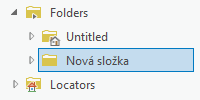
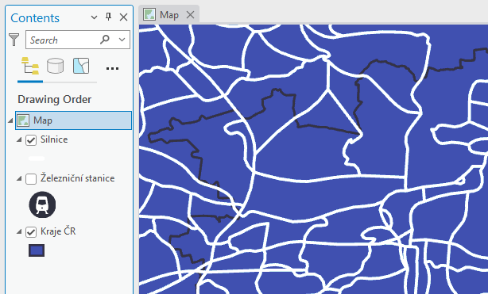
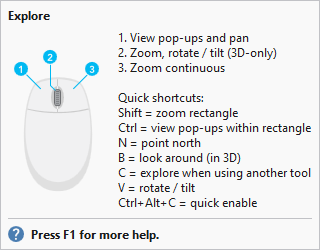
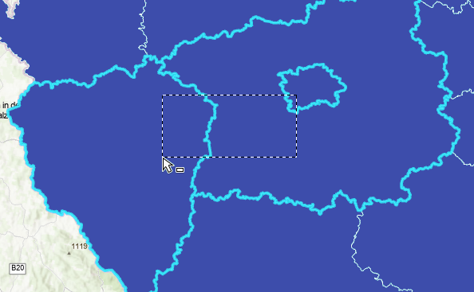
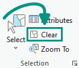
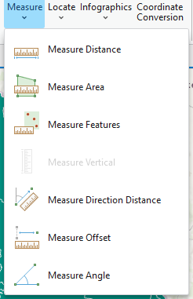

<!-- Definice sipky do FlexBoxu (pro referenci) – UZ NENI TREBA
<svg style="display: none" version="2.0">
  <defs>
    <symbol id="rect-arrow-right" viewBox="0 0 24 24">
      <path d="M5,21A2,2 0 0,1 3,19V5A2,2 0 0,1 5,3H19A2,2 0 0,1 21,5V19C21,20.11 20.1,21 19,21H5M6,13H14.5L11,16.5L12.42,17.92L18.34,12L12.42,6.08L11,7.5L14.5,11H6V13Z"
        style="fill:var(--md-primary-fg-color)" />
    </symbol>
    <symbol id="caret-right" height="1em" viewBox="0 0 256 512">
      <path d="M246.6 278.6c12.5-12.5 12.5-32.8 0-45.3l-128-128c-9.2-9.2-22.9-11.9-34.9-6.9s-19.8 16.6-19.8 29.6l0 256c0 12.9 7.8 24.6 19.8 29.6s25.7 2.2 34.9-6.9l128-128z" style="fill:var(--md-primary-fg-color)" />
    </symbol>
  <defs>
</svg> -->

# Introduction to ArcGIS, spatial data, data sources

## Goal

Introduction to ArcGIS Pro, basic orientation in the program environment, adding data to the map and controlling the map

## Basic terms

### Software for education

**ArcGIS Pro**, an advanced desktop geographic information system (GIS) developed by **Esri**, will be used during most of the class. It allows users to **create**, **edit**, **analyze**, and **visualize** spatial data in various layers, including **raster** and **vector** maps, **orthophotos**, **digital elevation model**, and other datasets.  
Users can create and edit **attributes** and **geometry** of features, perform advanced **analysis**, create and **publish map layers**, and create **interactive map applications**. The program also includes tools for **visualizing** data, creating map presentations, and **sharing results** with other users.

{ .off-glb width=200px style="filter:none !important;"}
{ .off-glb width=200px style="filter:none !important;"}
{: align=center}

Note:
Due to the high acquisition costs, ArcGIS is mainly used in large companies and government agencies. Its open source alternative QGIS is more widespread in smaller companies (this will be discussed at the end of the course).

### Spatial (GIS) data (vector)

Geographic Information System (GIS) generally uses any data containing **spatial (location) information**. A location can be represented not only by a combination of coordinates (_X + Y_, _latitude + longitude_, etc.), but also by, for example, an address (of arbitrary detail). In addition to the position information, any other information is usually added in the form of attributes in the **attribute table**.

{ style="width:80%;"}
{: style="margin-bottom:0px;" align=center }

<figcaption>Schematic illustration of spatial data and associated attribute tables</figcaption>

**Save spatial data**: Data can be stored in many different ways. There are many different data formats, but to start with, here are some basic ones.

- **Shapefile**: a format from _Esri_ with a mostly open specification. It contains the geometry and properties (attributes) of spatial features, probably the most widely used at present, although it has many disadvantages and is somewhat outdated from today's point of view. One of the characteristics of the format is mandatory division into multiple files (`.shp`, `.shx` and `.dbf`, possibly other optional), which brings difficulties when moving, copying, etc.
- **Geodatabase (GDB)**: the native data structure of the _ArcGIS_ system - the primary data format for data management and editing, it contains a collection of datasets of various types (vector, raster and others) and can also store data integrity (domains, subtypes, etc.) or topology
- **GeoJSON**: an open standard representing vector data and associated attributes, based on the `JSON` format and is therefore user-readable and widely used
- **GML / KML**: similar to GeoJSON - an open standard representing vector data and associated attributes, based on the `XML` format, thus again user-readable
- **GeoPackage (GPKG)**: relatively new format of the _OGC_ standard, supports both vector and raster data, overcomes many limitations of the `Shapefile` format (e.g. it is only 1 file), default format of _QGIS_
- **CSV**: although not a format directly intended for spatial data, it is often used as an exchange format, the file contains only attributes

<!-- Ve výčtu chybí některé __rastrové formáty__, těm se bude výuka věnovat v průběhu pozdějších cvičení. -->

## Practice content

### Starting and basic orientation in the program

At launch, the license is verified through the affiliation to the organization (CTU in Prague) - by logging in to the university account. The address (URL) for CTU is _ctuprague.maps.arcgis.com_ - then an automatic redirection to the university login page (in the format *username@cvut.cz* and password to KOS) takes place.

  
<iframe src="https://www.youtube.com/embed/8nDVpVmxM-0" title="YouTube video player" frameborder="0" allow="accelerometer; autoplay; clipboard-write; encrypted-media; gyroscope; picture-in-picture; web-share" allowfullscreen></iframe>

  

<table>
  <tbody>
    <tr>
      <td><strong>RIBBON</strong></td>
      <td>menu of program functions (element identical to other programs, e.g. Microsoft Word), menu changes contextually according to user actions</td>
    </tr>
    <tr>
      <td><strong>PANE</strong></td>
      <td>panels and function properties, many functions trigger opening their own Panel, through which the function is controlled, e.g. Map Contents, Symbology</td>
    </tr>
    <tr>
      <td><strong>VIEW</strong></td>
      <td>a window with a map (2D) or a scene (3D)</td>
    </tr>
  </tbody>
</table>

{: .process_container}

<figcaption>All VIEWs and PANEs are dockable - they can be freely moved around the screen and attached to other elements</figcaption>

<!-- :fontawesome-brands-youtube:{: style="color: #EE0F0F" } [__Working with Panes in ArcGIS Pro__](https://www.youtube.com/watch?v=qNDwVJV_kFk).
{: align=center } -->

[:material-open-in-new: Working with Panes in ArcGIS Pro](https://www.youtube.com/watch?v=qNDwVJV_kFk){ .md-button .md-button--primary .button_smaller target="\_blank"}
{: align=center style="display:flex; justify-content:center; align-items:center; column-gap:20px; row-gap:10px; flex-wrap:wrap;"}

---

 

Other sources:

[:material-open-in-new: pro.arcgis.com Introduction to ArcGIS Pro](https://pro.arcgis.com/en/pro-app/latest/get-started/get-started.htm){ .md-button .md-button--primary .url-name target="\_blank"}
[:material-open-in-new: pro.arcgis.com Introducing ArcGIS Pro](https://pro.arcgis.com/en/pro-app/latest/get-started/introducing-arcgis-pro.htm){ .md-button .md-button--primary .url-name target="\_blank"}
{: align=center style="display:flex; justify-content:center; align-items:center; column-gap:20px; row-gap:10px; flex-wrap:wrap;"}

### Adding data to the map

**Creating a map**:&nbsp;<code class="AGPF">:material-tab: Insert</code>&nbsp;→&nbsp;<code class="AGPF">:material-button-cursor: New Map</code>
{: style="margin-left:calc((100vw \* 0.03) - 6px)"}
{: style="display:flex !important; justify-content:flex-start; align-items:center;"}

[:material-open-in-new: Create a map or scene](https://pro.arcgis.com/en/pro-app/latest/help/projects/add-maps-to-a-project.htm#GUID-660CA711-919A-44B0-952A-F2054937077B){ .md-button .md-button--primary .button_smaller target="\_blank"}
{: align=center style="display:flex; justify-content:center; align-items:center; column-gap:20px; row-gap:10px; flex-wrap:wrap;"}

---

**Adding data to the map** (stored locally): <code class="AGPF">:material-tab: Map</code> → <code class="AGPF">:material-button-cursor: Add Data</code> → <code class="AGPF">:material-button-cursor: Data</code> → select a file...

{: .off-glb .process_icon}

{: .off-glb .process_icon}

{: .process_container}

<figcaption>If the file does not appear in the structure, the dialog can be refreshed with F5</figcaption>

[:material-open-in-new: Add data from the Add Data dialog box](https://pro.arcgis.com/en/pro-app/latest/help/mapping/layer-properties/add-layers-to-a-map.htm#ESRI_SECTION2_1C48753A1FD546F385580EF9197DBB8C){ .md-button .md-button--primary .button_smaller target="\_blank"}
{: align=center style="display:flex; justify-content:center; align-items:center; column-gap:20px; row-gap:10px; flex-wrap:wrap;"}

---

To avoid having to go through the directory structure each time to browse the data, it's a good idea to _join the data directories to the project_.

**Adding a directory to a project**: V _Catalog Pane_ ( <code class="AGPF">:material-tab: View</code> → <code class="AGPF">:material-button-cursor: Catalog Pane</code> ) right click on "_Folders_" select <code class="AGPF">:material-form-dropdown: Add Folder Connection</code> → insert or select a path... → drag & drop the data in the folder into the map area

{: .off-glb .process_icon}

{: .off-glb .process_icon}

{: .off-glb .process_icon}

{: .process_container}

<figcaption>The path to the selected folder will remain in the menu under "Folders". The directory does not have to be local, e.g. a faculty disk H:\ can be mounted this way.</figcaption>

[:material-open-in-new: Connect to a folder](https://pro.arcgis.com/en/pro-app/latest/help/projects/connect-to-a-folder.htm){ .md-button .md-button--primary .button_smaller target="\_blank"}
[:material-open-in-new: The Project Pane](https://pro.arcgis.com/en/pro-app/latest/help/projects/the-project-pane.htm){ .md-button .md-button--primary .button_smaller target="\_blank"}
{: align=center style="display:flex; justify-content:center; align-items:center; column-gap:20px; row-gap:10px; flex-wrap:wrap;"}

---

...the same can be done with a geodatabase. The geodatabase stores data more efficiently, but you can't put anything in it.

**Connecting the geodatabase to the project**: In _Catalog Pane_ ( <code class="AGPF">:material-tab: View</code> → <code class="AGPF">:material-button-cursor: Catalog Pane</code> ) right click on "_Databases_" select <code class="AGPF">:material-form-dropdown: Add Database</code> → insert or select a path to geodatabase... → drag and drop the data in the folder into the map area

{: .off-glb .process_icon}

{: .off-glb .process_icon}

{: .off-glb .process_icon}

{: .process_container}

<figcaption>The path to the selected geodatabase remains in the menu between the "Databases" items. Again, the path does not have to be local only.</figcaption>

[:material-open-in-new: Connect to a database](https://pro.arcgis.com/en/pro-app/latest/help/projects/connect-to-a-database.htm){ .md-button .md-button--primary .button_smaller target="\_blank"}
{: align=center style="display:flex; justify-content:center; align-items:center; column-gap:20px; row-gap:10px; flex-wrap:wrap;"}

---

**Layer order**: The map content (_Contents Pane_) shows all layers contained in the map. The visibility of each layer can be switched with the checkbox on the left. By changing the order of the layers in the table of contents, the order in which they are rendered in the map is changed.

{: .off-glb .process_icon}

{: .off-glb .process_icon}

{: .process_container}

<figcaption>Contents Pane and reorder and toggle layer visibility</figcaption>

---

**Map settings**: In the _Contents Pane_ right-click on the map name to select<code class="AGPF">:material-form-dropdown: Properties</code>

{: .off-glb .process_icon}

{: .off-glb .process_icon}

{: .process_container}

For starters, these items are of interest:

- **Tab "_General_"**:

  - **Name**
  - **Reference scale**: Fixes the size of the map symbology for the specified scale.
    [:material-open-in-new: Map reference scales](https://pro.arcgis.com/en/pro-app/latest/help/mapping/properties/map-reference-scales.htm){ .md-button .md-button--primary .button_smaller target="\_blank" align=right}
  - **Rotation**: Map rotation angle

- **Tab "_Coordinate systems_"**: Information about the map display coordinate system (separately for position and elevation).

  - WARNING**, if the coordinate system of the **inserted data** differs from the **map** system, the data is **temporarily** converted to the **map** coordinate system. However, this is an **On-the-fly** transformation, which is **simplified** for some coordinate system combinations, and the data may not relate to each other correctly. This situation is **not recommended** as it can produce **inaccurate results** for map visualization and data analysis. <a href="https://www.esri.com/arcgis-blog/products/arcgis-pro/mapping/projection-on-the-fly-and-geographic-transformations">**More information\*\*</a>
    {: style="color:#888;font-size:smaller; line-height:1.1;"}

 

### Where to get data

**Locally stored files**: access via system path, e.g.:

_C:\Users\Student1\Documents\Geodatabase.gdb\Layer1_
{: align="center" style="font-size:smaller;line-height:1.1;"}

_\\\\data.fsv.cvut.cz\Shares\K155\Public\data\PragueRoads.gdb_
{: align="center" style="font-size:smaller;line-height:1.1;"}

**Online downloadable data**: download from any source to a local disk in the form of files, same access as with locally stored files (see above)

[:material-open-in-new: ArcČR](https://www.arcgis.com/home/item.html?id=16fd9804dac04020938452a77c1ed350){ .md-button .md-button--primary .button_smaller target="\_blank"}
[:material-open-in-new: Geoportal Praha](https://www.geoportalpraha.cz/cs/data/otevrena-data/seznam){ .md-button .md-button--primary .button_smaller target="\_blank"}
[:material-open-in-new: Geoportal data.Brno](https://data.brno.cz/explore){ .md-button .md-button--primary .button_smaller target="\_blank"}
[:material-open-in-new: otevřená data AOPK](https://gis-aopkcr.opendata.arcgis.com/){ .md-button .md-button--primary .button_smaller target="\_blank"}
{: align=center style="display:flex; justify-content:center; align-items:center; column-gap:20px; row-gap:10px; flex-wrap:wrap;"}

**Connecting streaming data**: _will be part of future exercises_
{: style="color:#888"}

- connection of data services via URL, does not require manual local storage, there are multiple standards for providing these services
  {: style="color:#888;font-size:smaller; line-height:1.1;"}

 

### Map controls

**Explore Tool**: Movement in the map and pop-ups (pop-ups), see Fig.

- **Pop-up**: It is one of the basic elements of the graphical environment of GIS applications. Its (most common) purpose is to provide a quick preview of information about a given feature by clicking on its geometry. However, the form of the window is configurable and the editing tools very variable. By default, the pop-up displays a listing of attributes in table form (Figure).
  [:material-open-in-new: Pop-ups](https://pro.arcgis.com/en/pro-app/latest/help/mapping/navigation/pop-ups.htm){ .md-button .md-button--primary .button_smaller target="\_blank"}
- **Map scale**: Indicates the ratio of the map size to reality. In the corner of the map window (fig.) you can select from the offered scales or set any custom value.
  [:material-open-in-new: Map scales and scale properties](https://pro.arcgis.com/en/pro-app/latest/help/mapping/navigation/map-scales-and-scale-properties.htm){ .md-button .md-button--primary .button_smaller target="\_blank"}

{: .off-glb .process_icon}

{: .off-glb .process_icon}

{: .off-glb .process_icon}

{: .process_container}

[:material-open-in-new: Navigation](https://pro.arcgis.com/en/pro-app/latest/help/mapping/navigation/navigation-in-arcgis-pro.htm){ .md-button .md-button--primary .button_smaller target="\_blank"}
[:material-open-in-new: Navigate maps and scenes](https://pro.arcgis.com/en/pro-app/latest/get-started/navigate-your-data.htm){ .md-button .md-button--primary .button_smaller target="\_blank"}
{: align=center style="display:flex; justify-content:center; align-items:center; column-gap:20px; row-gap:10px; flex-wrap:wrap;"}

---

**Select Tool**: Map movement and interactive cursor selection. To deselect, see Fig.
{: #select-tool}

{: .off-glb .process_icon}

{: .off-glb .process_icon}

{: .off-glb .process_icon}

{: .process_container}

[:material-open-in-new: Select features interactively](https://pro.arcgis.com/en/pro-app/latest/help/mapping/navigation/select-features-interactively.htm){ .md-button .md-button--primary .button_smaller target="\_blank"}
[:material-open-in-new: Select features for editing](https://pro.arcgis.com/en/pro-app/latest/help/editing/select-features-for-editing.htm){ .md-button .md-button--primary .button_smaller target="\_blank"}
{: align=center style="display:flex; justify-content:center; align-items:center; column-gap:20px; row-gap:10px; flex-wrap:wrap;"}

---

**Measure Tool**: Interactive measurement of distances, angles, etc.

{: .off-glb .process_icon}

{: .off-glb .process_icon}

{: .process_container}

[:material-open-in-new: Measure](https://pro.arcgis.com/en/pro-app/latest/help/mapping/navigation/measure.htm){ .md-button .md-button--primary .button_smaller target="\_blank"}
{: align=center style="display:flex; justify-content:center; align-items:center; column-gap:20px; row-gap:10px; flex-wrap:wrap;"}

 

 

Additional resources:

[:material-open-in-new: pro.arcgis.com ArcGIS Pro keyboard shortcuts](https://pro.arcgis.com/en/pro-app/latest/get-started/arcgis-pro-keyboard-shortcuts.htm){ .md-button .md-button--primary .url-name target="\_blank"}
[:material-open-in-new: PDF ArcGIS Pro shortcuts](https://www.esri.com/content/dam/esrisites/en-us/media/pdf/g526942-arcgis-pro-kybrd-shrtct-FINAL.pdf){ .md-button .md-button--primary .url-name target="\_blank"}
{: align=center style="display:flex; justify-content:center; align-items:center; column-gap:20px; row-gap:10px; flex-wrap:wrap;"}

 

           

<!--
                  

Test nadpisů:

# Nadpis 1

## Nadpis 2

### Nadpis 3

#### Nadpis 4

##### Nadpis 5

###### Nadpis 6

...další text...

 -->
